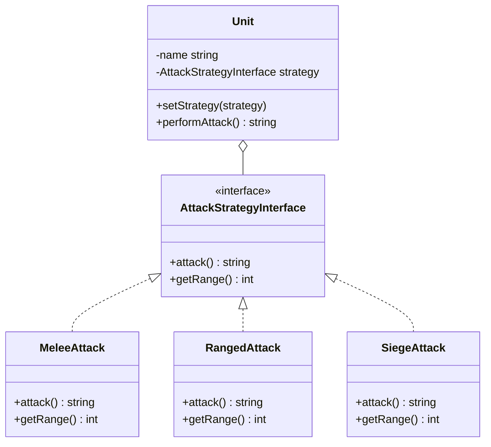

<script setup>
const exerciseFiles = [
  {
    filename: 'AttackStrategyInterface.php',
    code: [
      '<?php',
      '',
      'interface AttackStrategyInterface {',
      '    public function attack(): string;',
      '    public function getRange(): int;',
      '}',
    ].join('\n')
  },
  {
    filename: 'MeleeAttack.php',
    code: [
      '<?php',
      '',
      '/**',
      ' * TODO: 實作狂戰士 (Zealot) 的近戰攻擊策略',
      ' * 1. 實作 AttackStrategyInterface',
      ' * 2. attack() 回傳: "⚔️ 狂戰士揮動雙刃,對敵人造成 16 點近戰傷害!"',
      ' * 3. getRange() 回傳: 1',
      ' */',
    ].join('\n')
  },
  {
    filename: 'RangedAttack.php',
    code: [
      '<?php',
      '',
      '/**',
      ' * TODO: 實作陸戰隊員 (Marine) 的遠程攻擊策略',
      ' * 1. 實作 AttackStrategyInterface',
      ' * 2. attack() 回傳: "🔫 陸戰隊員舉起 C-14 步槍射擊,造成 6 點遠程傷害!"',
      ' * 3. getRange() 回傳: 5',
      ' */',
    ].join('\n')
  },
  {
    filename: 'SiegeAttack.php',
    code: [
      '<?php',
      '',
      'class SiegeAttack implements AttackStrategyInterface',
      '{',
      '    public function attack(): string',
      '    {',
      '        return "💥 攻城坦克進入架設模式,發射砲彈造成 40 點範圍傷害!";',
      '    }',
      '',
      '    public function getRange(): int',
      '    {',
      '        return 13;',
      '    }',
      '}',
    ].join('\n')
  },
  {
    filename: 'Unit.php',
    code: [
      '<?php',
      '',
      'class Unit',
      '{',
      '    private string $name;',
      '    private AttackStrategyInterface $strategy;',
      '',
      '    public function __construct(string $name, AttackStrategyInterface $strategy)',
      '    {',
      '        $this->name = $name;',
      '        $this->strategy = $strategy;',
      '    }',
      '',
      '    // 執行時動態切換策略',
      '    public function setStrategy(AttackStrategyInterface $strategy): void',
      '    {',
      '        $this->strategy = $strategy;',
      '    }',
      '',
      '    // Context 只負責呼叫,不負責選擇',
      '    public function performAttack(): string',
      '    {',
      '        return "[{$this->name}] " . $this->strategy->attack()',
      '            . " (射程: {$this->strategy->getRange()})";',
      '    }',
      '}',
    ].join('\n')
  },
  {
    filename: 'index.php',
    code: [
      '<?php',
      '',
      '// === 星海爭霸:建立你的部隊 ===',
      '$zealot = new Unit("狂戰士", new MeleeAttack());',
      '$marine = new Unit("陸戰隊員", new RangedAttack());',
      '$tank   = new Unit("攻城坦克", new SiegeAttack());',
      '',
      'echo $zealot->performAttack() . "\\n";',
      'echo $marine->performAttack() . "\\n";',
      'echo $tank->performAttack() . "\\n";',
      '',
      'echo "---\\n";',
      '',
      '// === 動態切換策略 ===',
      '// 陸戰隊員升級後切換為攻城模式',
      'echo "🔧 陸戰隊員升級,切換為攻城砲擊模式...\\n";',
      '$marine->setStrategy(new SiegeAttack());',
      'echo $marine->performAttack() . "\\n";',
    ].join('\n')
  }
]

const answerFiles = [
  {
    filename: 'AttackStrategyInterface.php',
    code: [
      '<?php',
      '',
      'interface AttackStrategyInterface {',
      '    public function attack(): string;',
      '    public function getRange(): int;',
      '}',
    ].join('\n')
  },
  {
    filename: 'MeleeAttack.php',
    code: [
      '<?php',
      '',
      'class MeleeAttack implements AttackStrategyInterface',
      '{',
      '    public function attack(): string',
      '    {',
      '        return "⚔️ 狂戰士揮動雙刃,對敵人造成 16 點近戰傷害!";',
      '    }',
      '',
      '    public function getRange(): int',
      '    {',
      '        return 1;',
      '    }',
      '}',
    ].join('\n')
  },
  {
    filename: 'RangedAttack.php',
    code: [
      '<?php',
      '',
      'class RangedAttack implements AttackStrategyInterface',
      '{',
      '    public function attack(): string',
      '    {',
      '        return "🔫 陸戰隊員舉起 C-14 步槍射擊,造成 6 點遠程傷害!";',
      '    }',
      '',
      '    public function getRange(): int',
      '    {',
      '        return 5;',
      '    }',
      '}',
    ].join('\n')
  },
  {
    filename: 'SiegeAttack.php',
    code: [
      '<?php',
      '',
      'class SiegeAttack implements AttackStrategyInterface',
      '{',
      '    public function attack(): string',
      '    {',
      '        return "💥 攻城坦克進入架設模式,發射砲彈造成 40 點範圍傷害!";',
      '    }',
      '',
      '    public function getRange(): int',
      '    {',
      '        return 13;',
      '    }',
      '}',
    ].join('\n')
  },
  {
    filename: 'Unit.php',
    code: [
      '<?php',
      '',
      'class Unit',
      '{',
      '    private string $name;',
      '    private AttackStrategyInterface $strategy;',
      '',
      '    public function __construct(string $name, AttackStrategyInterface $strategy)',
      '    {',
      '        $this->name = $name;',
      '        $this->strategy = $strategy;',
      '    }',
      '',
      '    public function setStrategy(AttackStrategyInterface $strategy): void',
      '    {',
      '        $this->strategy = $strategy;',
      '    }',
      '',
      '    public function performAttack(): string',
      '    {',
      '        return "[{$this->name}] " . $this->strategy->attack()',
      '            . " (射程: {$this->strategy->getRange()})";',
      '    }',
      '}',
    ].join('\n')
  },
  {
    filename: 'index.php',
    code: [
      '<?php',
      '',
      '$zealot = new Unit("狂戰士", new MeleeAttack());',
      '$marine = new Unit("陸戰隊員", new RangedAttack());',
      '$tank   = new Unit("攻城坦克", new SiegeAttack());',
      '',
      'echo $zealot->performAttack() . "\\n";',
      'echo $marine->performAttack() . "\\n";',
      'echo $tank->performAttack() . "\\n";',
      '',
      'echo "---\\n";',
      '',
      'echo "🔧 陸戰隊員升級,切換為攻城砲擊模式...\\n";',
      '$marine->setStrategy(new SiegeAttack());',
      'echo $marine->performAttack() . "\\n";',
    ].join('\n')
  }
]
</script>

# 策略模式 (Strategy Pattern)



## 何謂策略模式

策略模式就像《星海爭霸》裡面的兵種設計:每個兵種都會「攻擊」,但攻擊的方式完全不同——狂戰士是近身肉搏、陸戰隊員是遠距離射擊、攻城坦克則是超遠程砲擊。

**沒有策略模式時:**
1. 把所有攻擊邏輯塞在 `Unit` 類別裡面,用 `if ($type === 'zealot')...else if ($type === 'marine')...` 判斷
2. 每新增一個兵種,就要回去改 `Unit` 類別
3. 其他方法 (計算射程、判斷傷害類型...) 也得再寫一次 if-else

**使用策略模式:**
1. 定義「攻擊」的統一介面
2. 每種攻擊方式各自一個類別
3. `Unit` 只持有介面,不管是誰在打
4. 新增兵種 = 新增一個策略類,`Unit` 完全不用動

## 模式講解

1. 創建介面定義「一組可互換的演算法」共同的行為(如:`attack`、`getRange`)
2. 每個具體演算法各自實作介面
3. 創建 Context(這裡是 `Unit`),透過組合持有策略介面
4. Context 只呼叫策略、不選擇策略——選擇由外部(玩家、工廠、設定檔)決定
5. 執行期可以動態 `setStrategy()` 替換演算法

## 使用時機

1. 一個行為有多種可互換的實作方式
2. 想避免一堆 if-else / switch-case 散落在核心邏輯裡
3. 想讓演算法可以在執行時動態切換
4. 遵守 SOLID 中的 **Open/Closed 原則**(新增策略不用改 Context)
5. 遵守「組合優於繼承」原則

## 使用案例

你是《星海爭霸》的遊戲開發者,需要設計一套兵種攻擊系統:

1. 不同種族有各式各樣的兵種
2. 每個兵種的攻擊方式、傷害、射程都不同
3. 部分兵種還能在執行中「切換形態」(例如維京戰機可在戰機模式與機甲模式切換)
4. 未來 DLC 會新增兵種,但主程式不該因此每次都大改

## 關於「if-else 只是搬到 Client 端」的疑問

這是學策略模式時最常見的質疑。答案是:**if-else 沒有消失,而是被「集中」與「隔離」了。**

- ❌ 沒用策略模式:每個方法(攻擊、計算射程、判斷傷害類型...)都要重複寫一遍 if-else
- ✅ 用策略模式 + 工廠:if-else 只存在工廠**一個地方**,核心業務邏輯 (Unit) 完全乾淨
- 🚀 更進一步:工廠用 Map/Registry 註冊,連 if-else 都消失,新增兵種只要在 registry 加一行

**設計模式的精神不是消滅複雜度,而是把複雜度放到「對的地方」。**

## 互動練習

請完成 `MeleeAttack`(狂戰士近戰)和 `RangedAttack`(陸戰隊員遠程)這兩個攻擊策略。

- `MeleeAttack`:傷害訊息為揮刃,射程 1
- `RangedAttack`:傷害訊息為步槍射擊,射程 5
- `SiegeAttack`:已提供,射程 13

<ClientOnly>
  <PhpPlayground
    :files="exerciseFiles"
    :answer-files="answerFiles"
    entry-file="index.php"
    :readonly-files="['AttackStrategyInterface.php', 'SiegeAttack.php', 'Unit.php', 'index.php']"
  />
</ClientOnly>

::: tip 預期輸出
```
[狂戰士] ⚔️ 狂戰士揮動雙刃,對敵人造成 16 點近戰傷害! (射程: 1)
[陸戰隊員] 🔫 陸戰隊員舉起 C-14 步槍射擊,造成 6 點遠程傷害! (射程: 5)
[攻城坦克] 💥 攻城坦克進入架設模式,發射砲彈造成 40 點範圍傷害! (射程: 13)
---
🔧 陸戰隊員升級,切換為攻城砲擊模式...
[陸戰隊員] 💥 攻城坦克進入架設模式,發射砲彈造成 40 點範圍傷害! (射程: 13)
```
:::

## 實作解析

1. 定義統一介面 `AttackStrategyInterface`,規範所有攻擊策略都要有 `attack()` 和 `getRange()`
2. 每個兵種的攻擊方式各自一個類別(`MeleeAttack`、`RangedAttack`、`SiegeAttack`)
3. 建立 Context 類 `Unit`,透過建構子注入策略,並提供 `setStrategy()` 讓執行期能動態切換
4. Context 只呼叫策略、不選擇策略——**選擇交給外部**(玩家操作、工廠、設定檔)
5. 動態切換策略:`$marine->setStrategy(new SiegeAttack())`——策略可以在執行時替換
6. 新增兵種完全不用改 `Unit`:只要新增一個實作介面的類別即可,符合**開放封閉原則 (OCP)**
