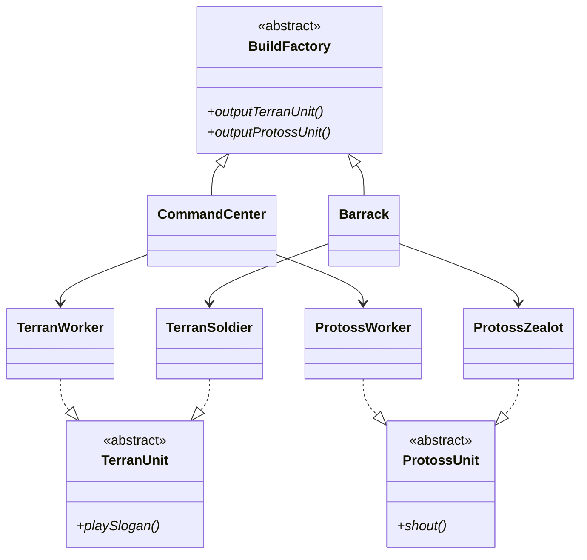

<script setup>
const exerciseFiles = [
  {
    filename: 'TerranUnit.php',
    code: [
      '<?php',
      '',
      'abstract class TerranUnit',
      '{',
      '    abstract public function playSlogan();',
      '}',
    ].join('\n')
  },
  {
    filename: 'TerranWorker.php',
    code: [
      '<?php',
      '',
      'class TerranWorker extends TerranUnit',
      '{',
      '    public function playSlogan()',
      '    {',
      '        echo "太空工程車準備完成。\\n";',
      '    }',
      '}',
    ].join('\n')
  },
  {
    filename: 'TerranSoldier.php',
    code: [
      '<?php',
      '',
      'class TerranSoldier extends TerranUnit',
      '{',
      '    public function playSlogan()',
      '    {',
      '        echo "想嘗嘗我的厲害嗎? 小子!\\n";',
      '    }',
      '}',
    ].join('\n')
  },
  {
    filename: 'ProtossUnit.php',
    code: [
      '<?php',
      '',
      'abstract class ProtossUnit',
      '{',
      '    abstract public function shout();',
      '}',
    ].join('\n')
  },
  {
    filename: 'ProtossWorker.php',
    code: [
      '<?php',
      '',
      'class ProtossWorker extends ProtossUnit',
      '{',
      '    public function shout()',
      '    {',
      '        echo "嘟嘟嘟!!\\n";',
      '    }',
      '}',
    ].join('\n')
  },
  {
    filename: 'ProtossZealot.php',
    code: [
      '<?php',
      '',
      'class ProtossZealot extends ProtossUnit',
      '{',
      '    public function shout()',
      '    {',
      '        echo "為艾爾而生!!\\n";',
      '    }',
      '}',
    ].join('\n')
  },
  {
    filename: 'BuildFactory.php',
    code: [
      '<?php',
      '',
      'abstract class BuildFactory',
      '{',
      '    abstract public function outputTerranUnit();',
      '    abstract public function outputProtossUnit();',
      '}',
    ].join('\n')
  },
  {
    filename: 'Barrack.php',
    code: [
      '<?php',
      '',
      '/**',
      ' * TODO: 實作 Barrack 工廠',
      ' * 1. 繼承 BuildFactory',
      ' * 2. outputTerranUnit() 回傳 new TerranSoldier()',
      ' * 3. outputProtossUnit() 回傳 new ProtossZealot()',
      ' */',
    ].join('\n')
  },
  {
    filename: 'CommandCenter.php',
    code: [
      '<?php',
      '',
      'class CommandCenter extends BuildFactory',
      '{',
      '    public function outputTerranUnit(): TerranWorker',
      '    {',
      '        return new TerranWorker();',
      '    }',
      '',
      '    public function outputProtossUnit(): ProtossWorker',
      '    {',
      '        return new ProtossWorker();',
      '    }',
      '}',
    ].join('\n')
  },
  {
    filename: 'index.php',
    code: [
      '<?php',
      '',
      'function switchCamp(BuildFactory $factory)',
      '{',
      '    $terranUnit = $factory->outputTerranUnit();',
      '    $protossUnit = $factory->outputProtossUnit();',
      '    $terranUnit->playSlogan();',
      '    $protossUnit->shout();',
      '}',
      '',
      'echo "=== 指揮中心 ===\\n";',
      'switchCamp(new CommandCenter());',
      '',
      'echo "\\n=== 兵營 ===\\n";',
      'switchCamp(new Barrack());',
    ].join('\n')
  }
]

const answerFiles = [
  ...exerciseFiles.slice(0, 7),
  {
    filename: 'Barrack.php',
    code: [
      '<?php',
      '',
      'class Barrack extends BuildFactory',
      '{',
      '    public function outputTerranUnit(): TerranSoldier',
      '    {',
      '        return new TerranSoldier();',
      '    }',
      '',
      '    public function outputProtossUnit(): ProtossZealot',
      '    {',
      '        return new ProtossZealot();',
      '    }',
      '}',
    ].join('\n')
  },
  exerciseFiles[8],
  exerciseFiles[9]
]
</script>

# 抽象工廠模式 (Abstract Factory)



## 何謂抽象工廠

與工廠方法相似，根據產品線去定義多個介面該產品的實際功能，再藉由生產者類別實作每個產品線中所對應的產品，最後再由抽象工廠去註冊這些產品的產出。

## 模式講解

當已經定義好某些產品類別（product），你不會希望新增新的系列產品線會造成你舊有的程式需要重新設計，最好的方式就是定義好工廠介面（即抽象工廠），並且定義好你的產品介面讓產品類別都需實作新的產品線。

## 使用案例

星海爭霸中增加了神族單位，需要能從某個建築產出時同時建造兩個種族的單位。

## 互動練習

`CommandCenter` 已實作好，請完成 `Barrack` 工廠，讓它能同時生產人族和神族的戰鬥單位。

<ClientOnly>
  <PhpPlayground
    :files="exerciseFiles"
    :answer-files="answerFiles"
    entry-file="index.php"
    :readonly-files="['TerranUnit.php', 'TerranWorker.php', 'TerranSoldier.php', 'ProtossUnit.php', 'ProtossWorker.php', 'ProtossZealot.php', 'BuildFactory.php', 'CommandCenter.php', 'index.php']"
  />
</ClientOnly>

::: tip 預期輸出
```
=== 指揮中心 ===
太空工程車準備完成。
嘟嘟嘟!!

=== 兵營 ===
想嘗嘗我的厲害嗎? 小子!
為艾爾而生!!
```
:::

## 缺點

1. 系統變得很複雜
2. 對於用戶端所有東西會變得很抽象（因為工廠數會非常多）
