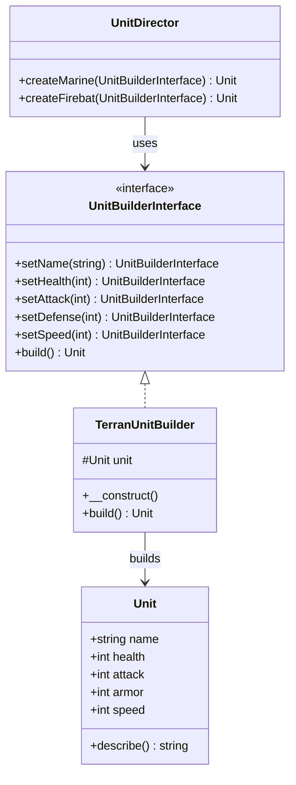

<script setup>
const exerciseFiles = [
  {
    filename: 'Unit.php',
    code: [
      '<?php',
      '',
      'class Unit',
      '{',
      '    public string $name;',
      '    public int $health;',
      '    public int $attack;',
      '    public int $armor;',
      '    public int $speed;',
      '',
      '    public function describe(): string',
      '    {',
      '        return sprintf(',
      '            "Unit: %s, Health: %d, Attack: %d, Armor: %d, Speed: %d",',
      '            $this->name,',
      '            $this->health,',
      '            $this->attack,',
      '            $this->armor,',
      '            $this->speed',
      '        );',
      '    }',
      '}',
    ].join('\n')
  },
  {
    filename: 'UnitBuilderInterface.php',
    code: [
      '<?php',
      '',
      'interface UnitBuilderInterface',
      '{',
      '    public function setName(string $name): UnitBuilderInterface;',
      '    public function setHealth(int $health): UnitBuilderInterface;',
      '    public function setAttack(int $attack): UnitBuilderInterface;',
      '    public function setDefense(int $defense): UnitBuilderInterface;',
      '    public function setSpeed(int $speed): UnitBuilderInterface;',
      '    public function build(): Unit;',
      '}',
    ].join('\n')
  },
  {
    filename: 'TerranUnitBuilder.php',
    code: [
      '<?php',
      '',
      '/**',
      ' * TODO: 實作 TerranUnitBuilder',
      ' * 1. 實作 UnitBuilderInterface',
      ' * 2. 建構子中建立 new Unit()',
      ' * 3. 每個 set 方法設定 Unit 屬性後回傳 $this（流式接口）',
      ' * 4. build() 回傳完成的 Unit 物件',
      ' *',
      ' * 提示: setDefense() 設定的是 $this->unit->armor',
      ' */',
    ].join('\n')
  },
  {
    filename: 'UnitDirector.php',
    code: [
      '<?php',
      '',
      'class UnitDirector',
      '{',
      '    public function createMarine(UnitBuilderInterface $builder): Unit',
      '    {',
      '        return $builder',
      "            ->setName('Marine')",
      '            ->setHealth(40)',
      '            ->setAttack(6)',
      '            ->setDefense(0)',
      '            ->setSpeed(5)',
      '            ->build();',
      '    }',
      '',
      '    public function createFirebat(UnitBuilderInterface $builder): Unit',
      '    {',
      '        return $builder',
      "            ->setName('Firebat')",
      '            ->setHealth(50)',
      '            ->setAttack(8)',
      '            ->setDefense(0)',
      '            ->setSpeed(4)',
      '            ->build();',
      '    }',
      '}',
    ].join('\n')
  },
  {
    filename: 'index.php',
    code: [
      '<?php',
      '',
      '$builder = new TerranUnitBuilder();',
      '$director = new UnitDirector();',
      '',
      '$marine = $director->createMarine($builder);',
      'echo $marine->describe() . "\\n";',
      '',
      '$builder2 = new TerranUnitBuilder();',
      '$firebat = $director->createFirebat($builder2);',
      'echo $firebat->describe() . "\\n";',
    ].join('\n')
  }
]

const answerFiles = [
  exerciseFiles[0],
  exerciseFiles[1],
  {
    filename: 'TerranUnitBuilder.php',
    code: [
      '<?php',
      '',
      'class TerranUnitBuilder implements UnitBuilderInterface',
      '{',
      '    protected Unit $unit;',
      '',
      '    public function __construct()',
      '    {',
      '        $this->unit = new Unit();',
      '    }',
      '',
      '    public function setName(string $name): UnitBuilderInterface',
      '    {',
      '        $this->unit->name = $name;',
      '        return $this;',
      '    }',
      '',
      '    public function setHealth(int $health): UnitBuilderInterface',
      '    {',
      '        $this->unit->health = $health;',
      '        return $this;',
      '    }',
      '',
      '    public function setAttack(int $attack): UnitBuilderInterface',
      '    {',
      '        $this->unit->attack = $attack;',
      '        return $this;',
      '    }',
      '',
      '    public function setDefense(int $defense): UnitBuilderInterface',
      '    {',
      '        $this->unit->armor = $defense;',
      '        return $this;',
      '    }',
      '',
      '    public function setSpeed(int $speed): UnitBuilderInterface',
      '    {',
      '        $this->unit->speed = $speed;',
      '        return $this;',
      '    }',
      '',
      '    public function build(): Unit',
      '    {',
      '        return $this->unit;',
      '    }',
      '}',
    ].join('\n')
  },
  exerciseFiles[3],
  exerciseFiles[4]
]
</script>

# 建造者模式 (Builder Pattern)



## 何謂建造者模式

> 將一個複雜物件的建構與其表示分離，使得同樣的建構過程可以創建不同的表示。

建造者模式就像現實世界的建築師一樣，建築師可以設計不同的房子，雖然每個房子長得不一樣，但建房子的步驟都一樣。

## 模式講解

將某個重複性的物件分離其建構的邏輯（如武器、護甲、鞋子等），確保此物件保持組裝彈性。

## 使用時機

1. 需要抽換不同組件
2. 建構過程過於複雜，需拆分多個步驟
3. 有相同建構流程但想產出不同物件
4. 減少建構子過於肥大

## 使用案例

星海爭霸中的各個單位都會有相同的建造模式（血量、武器、護甲、速度等），但每個單位的屬性都不一樣。

## 互動練習

請完成 `TerranUnitBuilder`，實作所有 set 方法（使用流式接口回傳 `$this`）和 `build()` 方法。

<ClientOnly>
  <PhpPlayground
    :files="exerciseFiles"
    :answer-files="answerFiles"
    entry-file="index.php"
    :readonly-files="['Unit.php', 'UnitBuilderInterface.php', 'UnitDirector.php', 'index.php']"
  />
</ClientOnly>

::: tip 預期輸出
```
Unit: Marine, Health: 40, Attack: 6, Armor: 0, Speed: 5
Unit: Firebat, Health: 50, Attack: 8, Armor: 0, Speed: 4
```
:::
