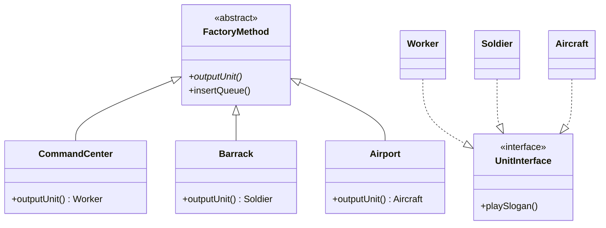

<script setup>
const exerciseFiles = [
  {
    filename: 'UnitInterface.php',
    code: [
      '<?php',
      '',
      'interface UnitInterface',
      '{',
      '    public function playSlogan();',
      '}',
    ].join('\n')
  },
  {
    filename: 'Worker.php',
    code: [
      '<?php',
      '',
      'class Worker implements UnitInterface',
      '{',
      "    const NAME = 'Worker';",
      '',
      '    public function playSlogan()',
      '    {',
      '        echo "SUV準備好了，長官你想蓋啥建築呢?\\n";',
      '    }',
      '}',
    ].join('\n')
  },
  {
    filename: 'Soldier.php',
    code: [
      '<?php',
      '',
      'class Soldier implements UnitInterface',
      '{',
      "    const NAME = 'Soldier';",
      '',
      '    public function playSlogan()',
      '    {',
      '        echo "想嘗嘗我的厲害嗎!小子。\\n";',
      '    }',
      '}',
    ].join('\n')
  },
  {
    filename: 'Aircraft.php',
    code: [
      '<?php',
      '',
      'class Aircraft implements UnitInterface',
      '{',
      "    const NAME = 'Aircraft';",
      '',
      '    public function playSlogan()',
      '    {',
      '        $this->build();',
      '        echo "幽靈轟炸機，待命中!";',
      '    }',
      '',
      '    private function build()',
      '    {',
      '        echo "組裝飛機中...\\n";',
      '    }',
      '}',
    ].join('\n')
  },
  {
    filename: 'FactoryMethod.php',
    code: [
      '<?php',
      '',
      'abstract class FactoryMethod',
      '{',
      '    abstract public function outputUnit();',
      '',
      '    public function insertQueue()',
      '    {',
      '        $unit = $this->outputUnit();',
      '        echo $unit::NAME . "加入生產陣列\\n";',
      '        echo "等待一下，正在生產中...\\n";',
      '        echo "生產完成!\\n";',
      '        $unit->playSlogan();',
      '        echo "\\n";',
      '    }',
      '}',
    ].join('\n')
  },
  {
    filename: 'Barrack.php',
    code: [
      '<?php',
      '',
      '/**',
      ' * TODO: 實作 Barrack 生產者類別',
      ' * 1. 繼承 FactoryMethod',
      ' * 2. 實作 outputUnit() 方法',
      ' * 3. 回傳 new Soldier()',
      ' */',
    ].join('\n')
  },
  {
    filename: 'Airport.php',
    code: [
      '<?php',
      '',
      '/**',
      ' * TODO: 實作 Airport 生產者類別',
      ' * 1. 繼承 FactoryMethod',
      ' * 2. 實作 outputUnit() 方法',
      ' * 3. 回傳 new Aircraft()',
      ' */',
    ].join('\n')
  },
  {
    filename: 'index.php',
    code: [
      '<?php',
      '',
      'function summon(FactoryMethod $creator)',
      '{',
      '    $creator->insertQueue();',
      '}',
      '',
      '$commandCenter = new CommandCenter();',
      'summon($commandCenter);',
      '',
      '$barrack = new Barrack();',
      'summon($barrack);',
      '',
      '$airport = new Airport();',
      'summon($airport);',
    ].join('\n')
  }
]

const answerFiles = [
  exerciseFiles[0],
  exerciseFiles[1],
  exerciseFiles[2],
  exerciseFiles[3],
  exerciseFiles[4],
  {
    filename: 'CommandCenter.php',
    code: [
      '<?php',
      '',
      'class CommandCenter extends FactoryMethod',
      '{',
      '    public function outputUnit(): Worker',
      '    {',
      '        return new Worker();',
      '    }',
      '}',
    ].join('\n')
  },
  {
    filename: 'Barrack.php',
    code: [
      '<?php',
      '',
      'class Barrack extends FactoryMethod',
      '{',
      '    public function outputUnit(): Soldier',
      '    {',
      '        return new Soldier();',
      '    }',
      '}',
    ].join('\n')
  },
  {
    filename: 'Airport.php',
    code: [
      '<?php',
      '',
      'class Airport extends FactoryMethod',
      '{',
      '    public function outputUnit(): Aircraft',
      '    {',
      '        return new Aircraft();',
      '    }',
      '}',
    ].join('\n')
  },
  exerciseFiles[7]
]

// Add CommandCenter to exercise files too (as readonly given)
exerciseFiles.splice(5, 0, {
  filename: 'CommandCenter.php',
  code: [
    '<?php',
    '',
    'class CommandCenter extends FactoryMethod',
    '{',
    '    public function outputUnit(): Worker',
    '    {',
    '        return new Worker();',
    '    }',
    '}',
  ].join('\n')
})
</script>

# 工廠方法模式 (Factory Method)



## 何謂工廠方法

> "Define an interface for creating an object, but let subclasses decide which class to instantiate." (Gang Of Four)

使用介面去定義每個產品應該做什麼，並且使用生產者類別去決定哪些產品類別該去實踐，而工廠方法則是將此概念實現的一種做法。

## 模式講解

1. 將產品的行為定義一套標準並用介面去規範
2. 將產品類別的實作放置於對應的生產者類別裡
3. 使用工廠方法去定義每個生產者類別實作產品類別接口
4. 使用者呼叫對應的生產者類別並使用工廠方法做到延遲以決定生產對應產品

## 使用時機

1. 無法預先知道會使用哪種類別時
2. 擴展軟件或框架內的組件時
3. 需要重複使用被創建的物件時

## 使用案例

星海爭霸中，建築物除了指揮中心，還有兵營、星際港，需要開發不同兵種並可以將任意單位建造加入佇列中。

## 互動練習

`CommandCenter` 已經實作好了，請完成 `Barrack` 和 `Airport` 生產者類別。

<ClientOnly>
  <PhpPlayground
    :files="exerciseFiles"
    :answer-files="answerFiles"
    entry-file="index.php"
    :readonly-files="['UnitInterface.php', 'Worker.php', 'Soldier.php', 'Aircraft.php', 'FactoryMethod.php', 'CommandCenter.php', 'index.php']"
  />
</ClientOnly>

::: tip 預期輸出
```
Worker加入生產陣列
等待一下，正在生產中...
生產完成!
SUV準備好了，長官你想蓋啥建築呢?

Soldier加入生產陣列
等待一下，正在生產中...
生產完成!
想嘗嘗我的厲害嗎!小子。

Aircraft加入生產陣列
等待一下，正在生產中...
生產完成!
組裝飛機中...
幽靈轟炸機，待命中!
```
:::
