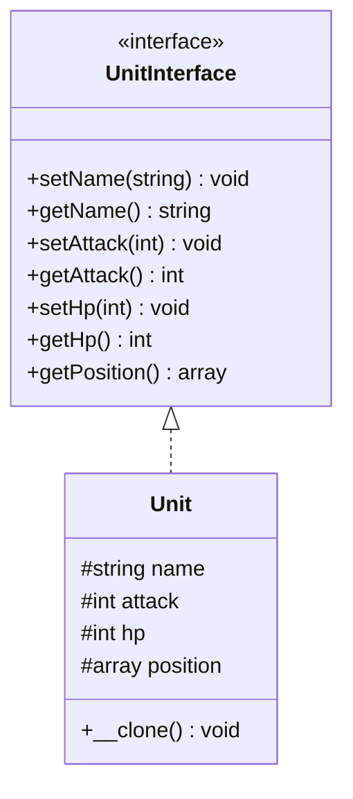

<script setup>
const exerciseFiles = [
  {
    filename: 'UnitInterface.php',
    code: [
      '<?php',
      '',
      'interface UnitInterface',
      '{',
      '    public function setName(string $name): void;',
      '    public function getName(): string;',
      '    public function setAttack(int $attack): void;',
      '    public function getAttack(): int;',
      '    public function setHp(int $hp): void;',
      '    public function getHp(): int;',
      '    public function getPosition(): array;',
      '}',
    ].join('\n')
  },
  {
    filename: 'Unit.php',
    code: [
      '<?php',
      '',
      'class Unit implements UnitInterface',
      '{',
      '    protected string $name;',
      '    protected int $attack;',
      '    protected int $hp;',
      '    protected array $position = [',
      "        'x' => 0,",
      "        'y' => 0,",
      '    ];',
      '',
      '    /**',
      '     * TODO: 實作 __clone() 魔術方法',
      '     * 當物件被 clone 時，隨機設定新的位置',
      '     * position x 和 y 各為 rand(0, 10)',
      '     */',
      '',
      '    public function setName(string $name): void { $this->name = $name; }',
      '    public function getName(): string { return $this->name; }',
      '    public function setAttack(int $attack): void { $this->attack = $attack; }',
      '    public function getAttack(): int { return $this->attack; }',
      '    public function setHp(int $hp): void { $this->hp = $hp; }',
      '    public function getHp(): int { return $this->hp; }',
      '    public function getPosition(): array { return $this->position; }',
      '}',
    ].join('\n')
  },
  {
    filename: 'index.php',
    code: [
      '<?php',
      '',
      '$wormPrototype = new Unit();',
      "$wormPrototype->setName('Worm');",
      '$wormPrototype->setAttack(0);',
      '$wormPrototype->setHp(1);',
      '',
      '$worm1 = clone $wormPrototype;',
      '$worm2 = clone $wormPrototype;',
      '',
      '$pos1 = $worm1->getPosition();',
      '$pos2 = $worm2->getPosition();',
      '',
      'echo "Worm1: " . $worm1->getName() . ", Attack: " . $worm1->getAttack() . ", HP: " . $worm1->getHp() . ", Position: X->" . $pos1["x"] . ", Y->" . $pos1["y"] . "\\n";',
      'echo "Worm2: " . $worm2->getName() . ", Attack: " . $worm2->getAttack() . ", HP: " . $worm2->getHp() . ", Position: X->" . $pos2["x"] . ", Y->" . $pos2["y"] . "\\n";',
      '',
      'echo "\\n兩隻幼蟲的位置不同，證明 clone 產生了獨立的物件！\\n";',
    ].join('\n')
  }
]

const answerFiles = [
  exerciseFiles[0],
  {
    filename: 'Unit.php',
    code: [
      '<?php',
      '',
      'class Unit implements UnitInterface',
      '{',
      '    protected string $name;',
      '    protected int $attack;',
      '    protected int $hp;',
      '    protected array $position = [',
      "        'x' => 0,",
      "        'y' => 0,",
      '    ];',
      '',
      '    public function __clone(): void',
      '    {',
      '        $this->position = [',
      "            'x' => rand(0, 10),",
      "            'y' => rand(0, 10),",
      '        ];',
      '    }',
      '',
      '    public function setName(string $name): void { $this->name = $name; }',
      '    public function getName(): string { return $this->name; }',
      '    public function setAttack(int $attack): void { $this->attack = $attack; }',
      '    public function getAttack(): int { return $this->attack; }',
      '    public function setHp(int $hp): void { $this->hp = $hp; }',
      '    public function getHp(): int { return $this->hp; }',
      '    public function getPosition(): array { return $this->position; }',
      '}',
    ].join('\n')
  },
  exerciseFiles[2]
]
</script>

# 原型模式 (Prototype Pattern)



## 何謂原型模式

> Prototype 模式的核心概念是：建立新物件不是「建構」，而是「複製」一個已存在的樣板���prototype）。

## 模式講解

在 PHP 中，原型模式通常是透過 `__clone()` 魔術方法來實現的。��你想要複製一個物件時，你可以調用 `clone`，這樣就能���到一個新的物件實例，而不是重新建構一個新的物件。

## 使用時機

1. 建立物件成本高（初始化很貴）
2. 想快速建立類似的物件
3. 系統中物件種類繁多，但彼此結構接近
4. 想動態決定要複製哪種實體類別

## 使用案例

還記得蟲族的幼蟲嗎，不必重新建造一個新的幼蟲，直接複製一個就可以了。

## 互動練習

請在 `Unit` 類別中實作 `__clone()` 魔術方法，讓每次複製時幼蟲會出現在不同的隨機位置。

<ClientOnly>
  <PhpPlayground
    :files="exerciseFiles"
    :answer-files="answerFiles"
    entry-file="index.php"
    :readonly-files="['UnitInterface.php', 'index.php']"
  />
</ClientOnly>

::: tip 預期輸出（位置為隨機值）
```
Worm1: Worm, Attack: 0, HP: 1, Position: X->3, Y->7
Worm2: Worm, Attack: 0, HP: 1, Position: X->9, Y->2

兩隻幼蟲的位置不同，證明 clone 產生了獨立的物件！
```
:::
