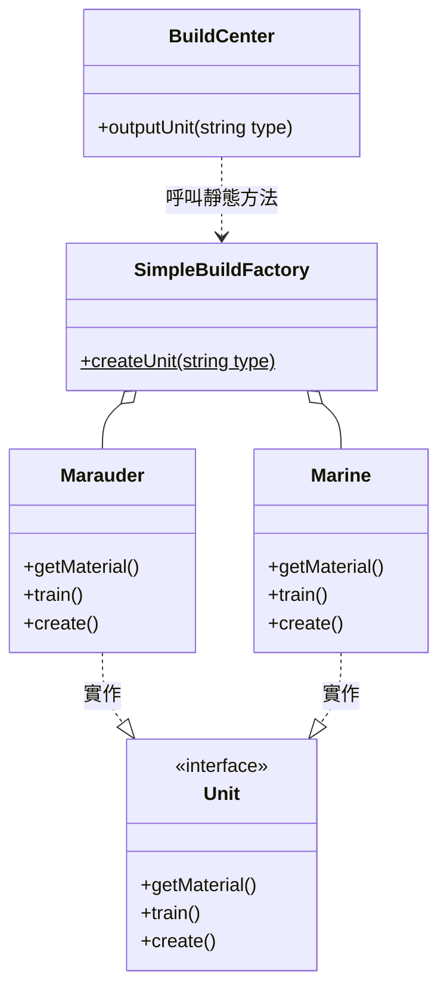

<script setup>
const exerciseFiles = [
  {
    filename: 'Unit.php',
    code: [
      '<?php',
      '',
      'interface Unit',
      '{',
      '    public function getMaterial();',
      '    public function train();',
      '    public function create();',
      '}',
    ].join('\n')
  },
  {
    filename: 'Marine.php',
    code: [
      '<?php',
      '',
      'class Marine implements Unit',
      '{',
      '    public function getMaterial()',
      '    {',
      '        echo "需要50單位的水晶\\n";',
      '    }',
      '',
      '    public function train()',
      '    {',
      '        echo "在10秒生成完成\\n";',
      '    }',
      '',
      '    public function create()',
      '    {',
      '        echo "想嘗嘗我的厲害嗎，小子？!\\n\\n";',
      '    }',
      '}',
    ].join('\n')
  },
  {
    filename: 'Marauder.php',
    code: [
      '<?php',
      '',
      'class Marauder implements Unit',
      '{',
      '    public function getMaterial()',
      '    {',
      '        echo "需要50單位晶礦，25單位高能瓦斯\\n";',
      '    }',
      '',
      '    public function train()',
      '    {',
      '        echo "在15後生成完成\\n";',
      '    }',
      '',
      '    public function create()',
      '    {',
      '        echo "卡碰！寶貝\\n\\n";',
      '    }',
      '}',
    ].join('\n')
  },
  {
    filename: 'SimpleBuildFactory.php',
    code: [
      '<?php',
      '',
      'class SimpleBuildFactory',
      '{',
      '    /**',
      '     * TODO: 實作 createUnit 靜態方法',
      '     * 根據傳入的 $type 參數建立對應的單位',
      '     * - "marauder" => 回傳 new Marauder()',
      '     * - "marine" => 回傳 new Marine()',
      '     * 提示: 使用 switch 或 match 語法',
      '     */',
      '    public static function createUnit($type)',
      '    {',
      '        // 在此填入你的程式碼',
      '    }',
      '}',
    ].join('\n')
  },
  {
    filename: 'BuildCenter.php',
    code: [
      '<?php',
      '',
      'class BuildCenter',
      '{',
      '    public function outputUnit($type)',
      '    {',
      '        $unit = SimpleBuildFactory::createUnit($type);',
      '        $unit->getMaterial();',
      '        $unit->train();',
      '        $unit->create();',
      '    }',
      '}',
    ].join('\n')
  },
  {
    filename: 'index.php',
    code: [
      '<?php',
      '',
      '$building = new BuildCenter();',
      '$building->outputUnit("marauder");',
      '$building->outputUnit("marine");',
    ].join('\n')
  }
]

const answerFiles = [
  exerciseFiles[0],
  exerciseFiles[1],
  exerciseFiles[2],
  {
    filename: 'SimpleBuildFactory.php',
    code: [
      '<?php',
      '',
      'class SimpleBuildFactory',
      '{',
      '    public static function createUnit($type)',
      '    {',
      '        switch ($type) {',
      '            case "marauder":',
      '                return new Marauder();',
      '            case "marine":',
      '                return new Marine();',
      '            default:',
      '                throw new \\Exception("Unknown unit type: $type");',
      '        }',
      '    }',
      '}',
    ].join('\n')
  },
  exerciseFiles[4],
  exerciseFiles[5]
]
</script>

# 簡單工廠模式 (Simple Factory)



## 何謂簡單工廠模式

當服務（產品）的種類比較單一，且不容易會有擴展或更改其當初設計時，就很適合使用簡單工廠模式。

使用者 `BuildCenter` 不需要知道**陸戰隊** `Marine` 和**掠奪者** `Marauder` 要怎麼建造，只要告訴 `SimpleBuildFactory` 我需要陸戰隊還是掠奪者就好，剩下就是等單位生產出來。

## 缺點

當你的產品線越來越複雜時，`SimpleBuildFactory` 中的 switch（或 if）將會長得非常恐怖。

## 互動練習

請完成 `SimpleBuildFactory` 的 `createUnit()` 靜態方法，根據傳入的類型建立對應的單位。

<ClientOnly>
  <PhpPlayground
    :files="exerciseFiles"
    :answer-files="answerFiles"
    entry-file="index.php"
    :readonly-files="['Unit.php', 'Marine.php', 'Marauder.php', 'BuildCenter.php', 'index.php']"
  />
</ClientOnly>

::: tip 預期輸出
```
需要50單位晶礦，25單位高能瓦斯
在15後生成完成
卡碰！寶貝

需要50單位的水晶
在10秒生成完成
想嘗嘗我的厲害嗎，小子？!
```
:::
