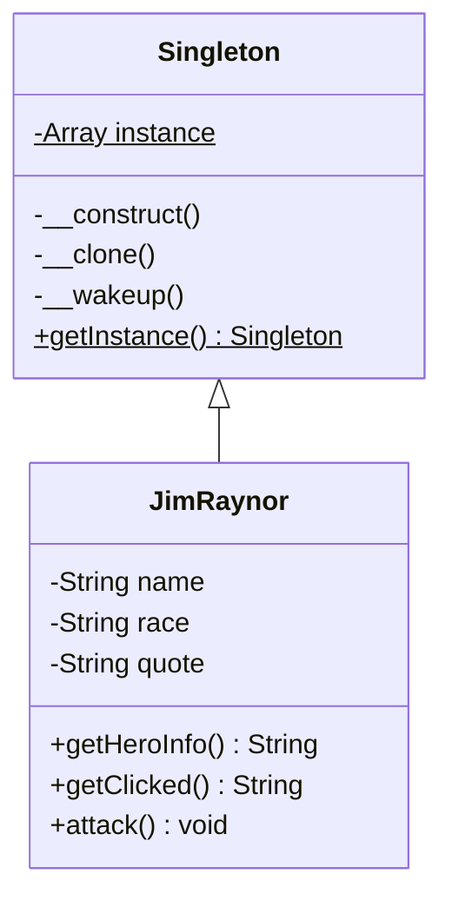

<script setup>
const exerciseFiles = [
  {
    filename: 'Singleton.php',
    code: [
      '<?php',
      '',
      'class Singleton',
      '{',
      '    private static $instance = [];',
      '',
      '    /**',
      '     * 建構子設為 protected，子類別可以使用',
      '     */',
      '    protected function __construct()',
      '    {',
      '    }',
      '',
      '    /**',
      '     * TODO: 實作 getInstance() 靜態方法',
      '     * 提示:',
      '     * 1. 使用 static::class 取得目前子類別名稱',
      '     * 2. 檢查 self::$instance 陣列中是否已有該子類別的實例',
      '     * 3. 若無，則 new static() 建立新實例並存入陣列',
      '     * 4. 回傳該實例',
      '     */',
      '    public static function getInstance()',
      '    {',
      '        // 在此填入你的程式碼',
      '    }',
      '',
      '    private function __clone()',
      '    {',
      '    }',
      '}',
    ].join('\n')
  },
  {
    filename: 'JimRaynor.php',
    code: [
      '<?php',
      '',
      '/**',
      ' * TODO: 建立 JimRaynor 類別',
      ' * 1. 繼承 Singleton',
      ' * 2. 加入私有屬性: name, race, quote',
      ' * 3. 實作 getHeroInfo() 回傳 "{name} is a {race}"',
      ' * 4. 實作 getClicked() 回傳 quote',
      ' * 5. 實作 attack() 輸出 "It is show time"',
      ' */',
    ].join('\n')
  },
  {
    filename: 'index.php',
    code: [
      '<?php',
      '',
      '$raynor = JimRaynor::getInstance();',
      'echo $raynor->getHeroInfo() . "\\n";',
      'echo $raynor->getClicked() . "\\n";',
      '$raynor->attack();',
    ].join('\n')
  }
]

const answerFiles = [
  {
    filename: 'Singleton.php',
    code: [
      '<?php',
      '',
      'class Singleton',
      '{',
      '    private static $instance = [];',
      '',
      '    protected function __construct()',
      '    {',
      '    }',
      '',
      '    public static function getInstance()',
      '    {',
      '        $subclass = static::class;',
      '        if (!isset(self::$instance[$subclass])) {',
      '            self::$instance[$subclass] = new static();',
      '        }',
      '',
      '        return self::$instance[$subclass];',
      '    }',
      '',
      '    private function __clone()',
      '    {',
      '    }',
      '}',
    ].join('\n')
  },
  {
    filename: 'JimRaynor.php',
    code: [
      '<?php',
      '',
      'class JimRaynor extends Singleton',
      '{',
      "    private $name = 'Jim Raynor';",
      "    private $race = 'Terran';",
      "    private $quote = 'This is Jimmy.';",
      '',
      '    public function getClicked()',
      '    {',
      '        return $this->quote;',
      '    }',
      '',
      '    public function getHeroInfo()',
      '    {',
      "        return $this->name . ' is a ' . $this->race;",
      '    }',
      '',
      '    public function attack()',
      '    {',
      '        echo "It is show time";',
      '    }',
      '}',
    ].join('\n')
  },
  {
    filename: 'index.php',
    code: [
      '<?php',
      '',
      '$raynor = JimRaynor::getInstance();',
      'echo $raynor->getHeroInfo() . "\\n";',
      'echo $raynor->getClicked() . "\\n";',
      '$raynor->attack();',
    ].join('\n')
  }
]
</script>

# 單例模式 (Singleton Pattern)



## 何謂單例模式

1. 保證一個類別只有一個實體。
2. 為實體提供一個統一的訪問位置。

單例模式就像現實世界的政府一樣，不管政府是由誰掌控，或者哪個黨上台，當你需要公權力介入時，"政府"就會進行回應。

## 模式講解

1. 將建構子設為私有，防止被 `new` 運算符使用
2. 使用一個公開的建構函數（如 `getInstance()` 函式），這個函式會私下使用建構子並把它保存在靜態變數中（static parameter），確保後續都返回同一個物件

## 使用時機

1. 確保使用的實例都是同一個
2. 保護此實體的全局變數不被進行修改
3. 程式發生問題只需修改一個地方

## 使用案例

在星海爭霸中，英雄單位都是獨一無二的，不像陸戰隊員可以同時出現在不同地方，所以英雄單位很適合使用單例模式。

### 開始實作解析

1. 先實作一個 `Singleton` 類別
2. 創建一個英雄類別並繼承 `Singleton`
3. 在英雄類別加入可以被使用的方法
4. 在使用的程式中取得英雄單位的實體

## 互動練習

請完成以下程式碼，實作 `Singleton` 基礎類別的 `getInstance()` 方法，以及 `JimRaynor` 英雄類別。

<ClientOnly>
  <PhpPlayground
    :files="exerciseFiles"
    :answer-files="answerFiles"
    entry-file="index.php"
    :readonly-files="['index.php']"
  />
</ClientOnly>

::: tip 預期輸出
```
Jim Raynor is a Terran
This is Jimmy.
It is show time
```
:::

---

::: warning 關於單例模式
單例模式因其便利性確實還有許多框架使用，但其實此模式違反了設計模式中的**單一職責原則**（此模式可以大範圍被函式使用），大量使用此模式可能造成測試上的困難，目前 PHP 開源社群正逐漸淘汰此設計模式。
:::
