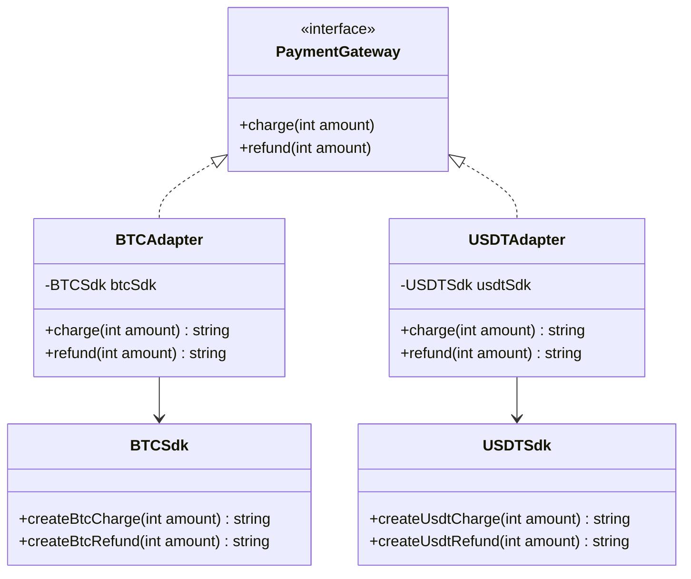

<script setup>
const exerciseFiles = [
  {
    filename: 'PaymentGateway.php',
    code: [
      '<?php',
      '',
      'interface PaymentGateway',
      '{',
      '    public function charge(int $amount);',
      '    public function refund(int $amount);',
      '}',
    ].join('\n')
  },
  {
    filename: 'BTCSdk.php',
    code: [
      '<?php',
      '',
      'class BTCSdk',
      '{',
      '    public function createBtcCharge(int $amount): string',
      '    {',
      '        return "BTC charge of $amount created.\\n";',
      '    }',
      '',
      '    public function createBtcRefund(int $amount): string',
      '    {',
      '        return "BTC refund of $amount created.\\n";',
      '    }',
      '}',
    ].join('\n')
  },
  {
    filename: 'USDTSdk.php',
    code: [
      '<?php',
      '',
      'class USDTSdk',
      '{',
      '    public function createUsdtCharge(int $amount): string',
      '    {',
      '        return "USDT charge of $amount created.\\n";',
      '    }',
      '',
      '    public function createUsdtRefund(int $amount): string',
      '    {',
      '        return "USDT refund of $amount created.\\n";',
      '    }',
      '}',
    ].join('\n')
  },
  {
    filename: 'BTCAdapter.php',
    code: [
      '<?php',
      '',
      '/**',
      ' * TODO: 實作 BTCAdapter',
      ' * 1. 實作 PaymentGateway 介面',
      ' * 2. 建構子接收 BTCSdk 實例',
      ' * 3. charge() 中呼叫 BTCSdk 的 createBtcCharge()',
      ' * 4. refund() 中呼叫 BTCSdk 的 createBtcRefund()',
      ' */',
    ].join('\n')
  },
  {
    filename: 'USDTAdapter.php',
    code: [
      '<?php',
      '',
      'class USDTAdapter implements PaymentGateway',
      '{',
      '    private USDTSdk $usdtSdk;',
      '',
      '    public function __construct(USDTSdk $sdk)',
      '    {',
      '        $this->usdtSdk = $sdk;',
      '    }',
      '',
      '    public function charge(int $amount)',
      '    {',
      '        echo "Charging $amount USDT\\n";',
      '        return $this->usdtSdk->createUsdtCharge($amount);',
      '    }',
      '',
      '    public function refund(int $amount)',
      '    {',
      '        echo "Refunding $amount USDT\\n";',
      '        return $this->usdtSdk->createUsdtRefund($amount);',
      '    }',
      '}',
    ].join('\n')
  },
  {
    filename: 'index.php',
    code: [
      '<?php',
      '',
      'class PaymentService',
      '{',
      '    protected PaymentGateway $paymentGateway;',
      '',
      '    public function __construct(PaymentGateway $paymentGateway)',
      '    {',
      '        $this->paymentGateway = $paymentGateway;',
      '    }',
      '',
      '    public function checkout(int $amount, string $type): string',
      '    {',
      '        return match ($type) {',
      "            'charge' => $this->paymentGateway->charge($amount),",
      "            'refund' => $this->paymentGateway->refund($amount),",
      '            default => "Invalid payment type",',
      '        };',
      '    }',
      '}',
      '',
      '$btc = new BTCAdapter(new BTCSdk());',
      '$checkout = new PaymentService($btc);',
      "echo $checkout->checkout(100, 'charge');",
      "echo $checkout->checkout(50, 'refund');",
      '',
      '$usdt = new USDTAdapter(new USDTSdk());',
      '$checkout = new PaymentService($usdt);',
      "echo $checkout->checkout(200, 'charge');",
      "echo $checkout->checkout(150, 'refund');",
    ].join('\n')
  }
]

const answerFiles = [
  exerciseFiles[0],
  exerciseFiles[1],
  exerciseFiles[2],
  {
    filename: 'BTCAdapter.php',
    code: [
      '<?php',
      '',
      'class BTCAdapter implements PaymentGateway',
      '{',
      '    private BTCSdk $btcSdk;',
      '',
      '    public function __construct(BTCSdk $sdk)',
      '    {',
      '        $this->btcSdk = $sdk;',
      '    }',
      '',
      '    public function charge(int $amount): string',
      '    {',
      '        echo "Charging $amount BTC\\n";',
      '        return $this->btcSdk->createBtcCharge($amount);',
      '    }',
      '',
      '    public function refund(int $amount): string',
      '    {',
      '        echo "Refunding $amount BTC\\n";',
      '        return $this->btcSdk->createBtcRefund($amount);',
      '    }',
      '}',
    ].join('\n')
  },
  exerciseFiles[4],
  exerciseFiles[5]
]
</script>

# 轉接器模式 (Adapter Pattern)



## 何謂轉接器模式

用最日常的例子來說就是手機充電線通常是 USB 的頭，但牆壁的頭是兩孔甚至是三孔。如果要讓手機充電，就需要一個轉接頭，這就是轉接器模式的概念，讓你既不用改 USB 的頭也不用改牆壁的插孔。

實作前有兩個前提：
1. 你必須確保 USB 頭永遠不變（外接的程序介面不變）
2. 你必須確保牆壁的插孔永遠不變（核心處理程序的介面不變）

## 模式講解

1. 你有一個核心處理程序的介面（`PaymentGateway`），統一處理方法
2. 撰寫 Adapter 類別，實作核心介面，內部使用要調配的 SDK 類別
3. 在 Adapter 中將 SDK 的方法轉接到統一介面

## 使用時機

1. **導入第三方 SDK，但介面不同**
2. **想讓舊程式碼能配合新架構**
3. **想讓相同接口支援多種實作**

## 互動練習

`USDTAdapter` 已經實作好，請參考它完成 `BTCAdapter`。

<ClientOnly>
  <PhpPlayground
    :files="exerciseFiles"
    :answer-files="answerFiles"
    entry-file="index.php"
    :readonly-files="['PaymentGateway.php', 'BTCSdk.php', 'USDTSdk.php', 'USDTAdapter.php', 'index.php']"
  />
</ClientOnly>

::: tip 預期輸出
```
Charging 100 BTC
BTC charge of 100 created.
Refunding 50 BTC
BTC refund of 50 created.
Charging 200 USDT
USDT charge of 200 created.
Refunding 150 USDT
USDT refund of 150 created.
```
:::
