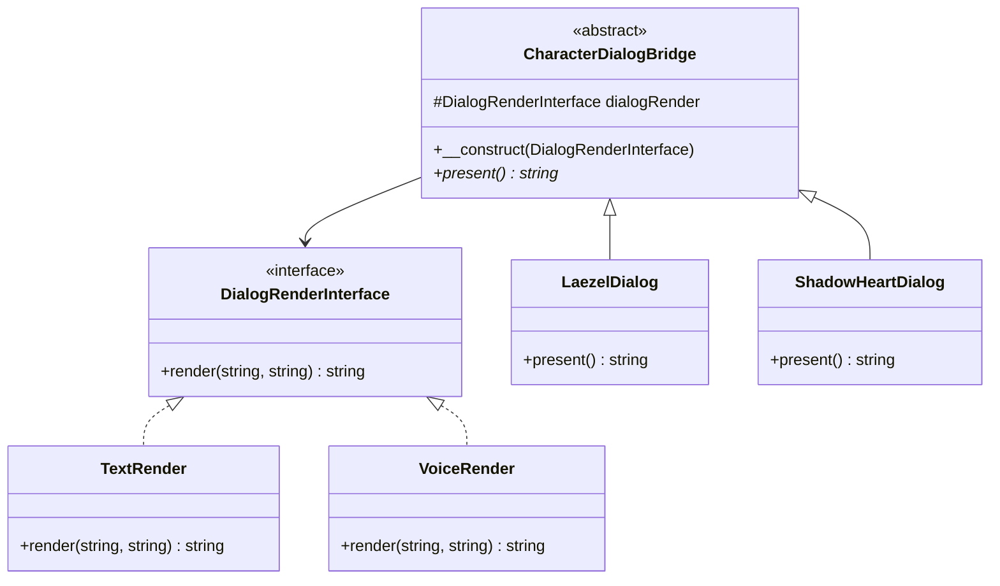

<script setup>
const exerciseFiles = [
  {
    filename: 'DialogRenderInterface.php',
    code: [
      '<?php',
      '',
      'interface DialogRenderInterface',
      '{',
      '    public function render(string $characterName, string $script): string;',
      '}',
    ].join('\n')
  },
  {
    filename: 'TextRender.php',
    code: [
      '<?php',
      '',
      '/**',
      ' * TODO: 實作 TextRender',
      ' * 1. 實作 DialogRenderInterface',
      ' * 2. render() 回傳 "[Text] {characterName} says: \\"{script}\\""',
      ' */',
    ].join('\n')
  },
  {
    filename: 'VoiceRender.php',
    code: [
      '<?php',
      '',
      'class VoiceRender implements DialogRenderInterface',
      '{',
      '    public function render(string $characterName, string $script): string',
      '    {',
      '        return "[Voice] Playing character audio for $characterName says: \\"$script\\"";',
      '    }',
      '}',
    ].join('\n')
  },
  {
    filename: 'CharacterDialogBridge.php',
    code: [
      '<?php',
      '',
      'abstract class CharacterDialogBridge',
      '{',
      '    protected DialogRenderInterface $dialogRender;',
      '',
      '    public function __construct(DialogRenderInterface $dialogRender)',
      '    {',
      '        $this->dialogRender = $dialogRender;',
      '    }',
      '',
      '    abstract public function present(): string;',
      '}',
    ].join('\n')
  },
  {
    filename: 'LaezelDialog.php',
    code: [
      '<?php',
      '',
      'class LaezelDialog extends CharacterDialogBridge',
      '{',
      '    protected $characterName, $script;',
      '',
      '    public function __construct($render)',
      '    {',
      '        parent::__construct($render);',
      '        $this->characterName = "Laezel";',
      '        $this->script = "I am Laezel, a Githyanki warrior. I will not be your pawn.";',
      '    }',
      '',
      '    public function present(): string',
      '    {',
      '        return $this->dialogRender->render($this->characterName, $this->script);',
      '    }',
      '}',
    ].join('\n')
  },
  {
    filename: 'ShadowHeartDialog.php',
    code: [
      '<?php',
      '',
      'class ShadowHeartDialog extends CharacterDialogBridge',
      '{',
      '    protected $characterName, $script;',
      '',
      '    public function __construct($render)',
      '    {',
      '        parent::__construct($render);',
      '        $this->characterName = "Shadowheart";',
      '        $this->script = "I am Shadowheart, a cleric of Shar. I have my own agenda.";',
      '    }',
      '',
      '    public function present(): string',
      '    {',
      '        return $this->dialogRender->render($this->characterName, $this->script);',
      '    }',
      '}',
    ].join('\n')
  },
  {
    filename: 'index.php',
    code: [
      '<?php',
      '',
      '// 使用文字渲染器',
      '$dialog1 = new LaezelDialog(new TextRender());',
      'echo $dialog1->present() . "\\n";',
      '',
      '// 使用聲音渲染器',
      '$dialog2 = new ShadowHeartDialog(new VoiceRender());',
      'echo $dialog2->present() . "\\n";',
      '',
      '// 自由組合：Laezel + VoiceRender',
      '$dialog3 = new LaezelDialog(new VoiceRender());',
      'echo $dialog3->present() . "\\n";',
    ].join('\n')
  }
]

const answerFiles = [
  exerciseFiles[0],
  {
    filename: 'TextRender.php',
    code: [
      '<?php',
      '',
      'class TextRender implements DialogRenderInterface',
      '{',
      '    public function render(string $characterName, string $script): string',
      '    {',
      '        return "[Text] $characterName says: \\"$script\\"";',
      '    }',
      '}',
    ].join('\n')
  },
  ...exerciseFiles.slice(2)
]
</script>

# 橋接模式 (Bridge Pattern)



## 何謂橋接模式

橋接模式的概念是將抽象部分與實現部分分離。以博德之門為例，「對話」在這款遊戲佔了很大比重，不同角色跟 NPC 對話會觸發不同文本，而在對話的呈現上又可以分「文字」、「語音」、「動畫」等多種方式。這個對話模組就很適合使用橋接模式。

## 模式講解

1. 定義你的抽象類別（角色對話）
2. 拆分抽象類別中會實作的類別（渲染方式）
3. 將抽象與實作類別進行對接並呈現效果

## 使用時機

1. 各對話模式對應多角色自由組合，各自獨立擴展
2. 避免 class 爆炸
3. 拆開來檢測更容易

## 互動練習

`VoiceRender` 已經實作好，請參考它完成 `TextRender` 渲染器。

<ClientOnly>
  <PhpPlayground
    :files="exerciseFiles"
    :answer-files="answerFiles"
    entry-file="index.php"
    :readonly-files="['DialogRenderInterface.php', 'VoiceRender.php', 'CharacterDialogBridge.php', 'LaezelDialog.php', 'ShadowHeartDialog.php', 'index.php']"
  />
</ClientOnly>

::: tip 預期輸出
```
[Text] Laezel says: "I am Laezel, a Githyanki warrior. I will not be your pawn."
[Voice] Playing character audio for Shadowheart says: "I am Shadowheart, a cleric of Shar. I have my own agenda."
[Voice] Playing character audio for Laezel says: "I am Laezel, a Githyanki warrior. I will not be your pawn."
```
:::
