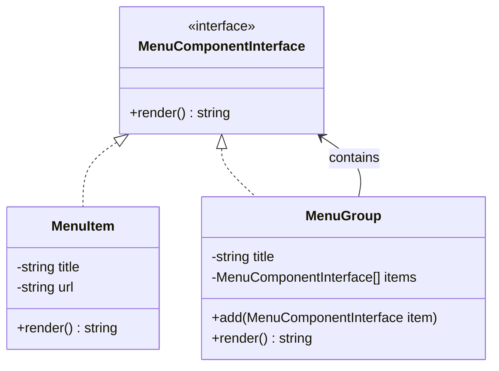

<script setup>
const exerciseFiles = [
  {
    filename: 'MenuComponentInterface.php',
    code: [
      '<?php',
      '',
      'interface MenuComponentInterface',
      '{',
      '    public function render(): string;',
      '}',
    ].join('\n')
  },
  {
    filename: 'MenuItem.php',
    code: [
      '<?php',
      '',
      'class MenuItem implements MenuComponentInterface',
      '{',
      '    protected $title;',
      '    protected $url;',
      '',
      '    public function __construct(string $title, string $url)',
      '    {',
      '        $this->title = $title;',
      '        $this->url = $url;',
      '    }',
      '',
      '    public function render(): string',
      '    {',
      '        return "- [$this->title]($this->url)\\n";',
      '    }',
      '}',
    ].join('\n')
  },
  {
    filename: 'MenuGroup.php',
    code: [
      '<?php',
      '',
      '/**',
      ' * TODO: 實作 MenuGroup 組合類',
      ' * 1. 實作 MenuComponentInterface',
      ' * 2. 建構子接收 title 字串',
      ' * 3. 有一個 $items 陣列存放子元件',
      ' * 4. add() 方法接收 MenuComponentInterface 加入 $items',
      ' * 5. render() 方法：',
      ' *    - 先輸出自己的 title',
      ' *    - 再遞迴呼叫每個子元件的 render()',
      ' *    - 子元件前加 "  " 縮排',
      ' */',
    ].join('\n')
  },
  {
    filename: 'index.php',
    code: [
      '<?php',
      '',
      '$root = new MenuGroup("Main Menu");',
      '$root->add(new MenuItem("Home", "/home"));',
      '$root->add(new MenuItem("About", "/about"));',
      '',
      '$products = new MenuGroup("Products");',
      '$products->add(new MenuItem("Web Development", "/products/web"));',
      '$products->add(new MenuItem("SEO", "/products/seo"));',
      '',
      '$cloud = new MenuGroup("Cloud");',
      '$cloud->add(new MenuItem("AWS", "/cloud/aws"));',
      '$cloud->add(new MenuItem("Azure", "/cloud/azure"));',
      '$products->add($cloud);',
      '',
      '$root->add($products);',
      '$root->add(new MenuItem("Contact", "/contact"));',
      '',
      'echo $root->render();',
    ].join('\n')
  }
]

const answerFiles = [
  exerciseFiles[0],
  exerciseFiles[1],
  {
    filename: 'MenuGroup.php',
    code: [
      '<?php',
      '',
      'class MenuGroup implements MenuComponentInterface',
      '{',
      '    protected $title;',
      '    protected $items = [];',
      '',
      '    public function __construct(string $title)',
      '    {',
      '        $this->title = $title;',
      '    }',
      '',
      '    public function add(MenuComponentInterface $item): void',
      '    {',
      '        $this->items[] = $item;',
      '    }',
      '',
      '    public function render(): string',
      '    {',
      '        $output = "[$this->title]\\n";',
      '        foreach ($this->items as $item) {',
      '            $lines = explode("\\n", rtrim($item->render(), "\\n"));',
      '            foreach ($lines as $line) {',
      '                if ($line !== "") {',
      '                    $output .= "  " . $line . "\\n";',
      '                }',
      '            }',
      '        }',
      '        return $output;',
      '    }',
      '}',
    ].join('\n')
  },
  exerciseFiles[3]
]
</script>

# 組合模式 (Composite Pattern)



## 何謂組合模式

此模式偏向是一種設計概念，凡設計結構偏向樹狀結構，都可以使用此模式。

## 模式講解

用一棵樹的方式來描述，它通常會包含三個角色：
1. **Component（元件介面）**：定義所有具體元件和容器的共同行為
2. **Leaf（葉節點）**：樹的最底層，不包含子元素。例如：檔案、員工
3. **Composite（容器）**：可以包含其他 Leaf 或 Composite，本身也是一個 Component。例如：資料夾、部門

## 使用案例

每個網站都有一個導航列，這個導航列通常會包含多個選單項目，非常適合用來表示此模式的設計核心。

## 互動練習

`MenuItem`（葉節點）已經實作好，請完成 `MenuGroup`（容器），讓它可以包含其他選單項目並遞迴渲染。

<ClientOnly>
  <PhpPlayground
    :files="exerciseFiles"
    :answer-files="answerFiles"
    entry-file="index.php"
    :readonly-files="['MenuComponentInterface.php', 'MenuItem.php', 'index.php']"
  />
</ClientOnly>

::: tip 預期輸出
```
[Main Menu]
  - [Home](/home)
  - [About](/about)
  [Products]
    - [Web Development](/products/web)
    - [SEO](/products/seo)
    [Cloud]
      - [AWS](/cloud/aws)
      - [Azure](/cloud/azure)
  - [Contact](/contact)
```
:::
