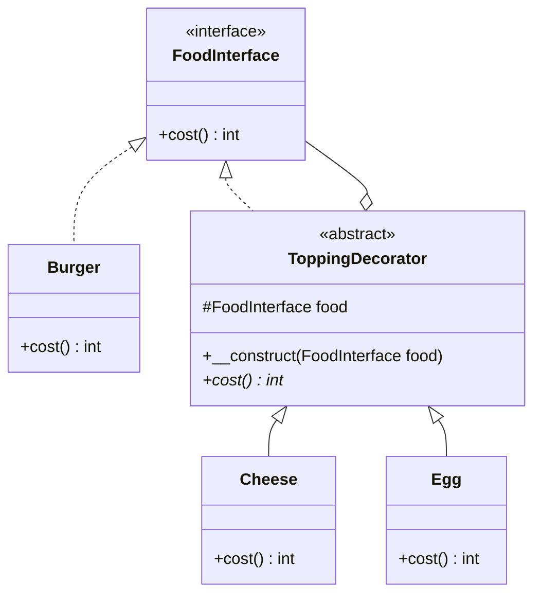

<script setup>
const exerciseFiles = [
  {
    filename: 'FoodInterface.php',
    code: [
      '<?php',
      '',
      'interface FoodInterface {',
      '    public function cost();',
      '}',
    ].join('\n')
  },
  {
    filename: 'Burger.php',
    code: [
      '<?php',
      '',
      'class Burger implements FoodInterface',
      '{',
      '    public function cost()',
      '    {',
      '        return 50;',
      '    }',
      '}',
    ].join('\n')
  },
  {
    filename: 'ToppingDecorator.php',
    code: [
      '<?php',
      '',
      'abstract class ToppingDecorator implements FoodInterface',
      '{',
      '    protected FoodInterface $food;',
      '',
      '    public function __construct(FoodInterface $food)',
      '    {',
      '        $this->food = $food;',
      '    }',
      '',
      '    abstract public function cost();',
      '}',
    ].join('\n')
  },
  {
    filename: 'Cheese.php',
    code: [
      '<?php',
      '',
      '/**',
      ' * TODO: 實作 Cheese 裝飾器',
      ' * 1. 繼承 ToppingDecorator',
      ' * 2. 實作 cost() 方法',
      ' * 3. 在原本食物的價格上加 15 元',
      ' * 提示: 使用 $this->food->cost() 取得被裝飾物件的價格',
      ' */',
    ].join('\n')
  },
  {
    filename: 'Egg.php',
    code: [
      '<?php',
      '',
      '/**',
      ' * TODO: 實作 Egg 裝飾器',
      ' * 1. 繼承 ToppingDecorator',
      ' * 2. 實作 cost() 方法',
      ' * 3. 在原本食物的價格上加 10 元',
      ' */',
    ].join('\n')
  },
  {
    filename: 'index.php',
    code: [
      '<?php',
      '',
      '// 層層套裝 Decorator：起司蛋堡',
      '$burger = new Cheese(new Egg(new Burger()));',
      'echo "起司蛋堡價格：" . $burger->cost() . " 元\\n";',
      '',
      '// 只加蛋',
      '$eggBurger = new Egg(new Burger());',
      'echo "蛋堡價格：" . $eggBurger->cost() . " 元\\n";',
      '',
      '// 雙倍起司',
      '$doubleCheese = new Cheese(new Cheese(new Burger()));',
      'echo "雙倍起司堡價格：" . $doubleCheese->cost() . " 元\\n";',
    ].join('\n')
  }
]

const answerFiles = [
  {
    filename: 'FoodInterface.php',
    code: [
      '<?php',
      '',
      'interface FoodInterface {',
      '    public function cost();',
      '}',
    ].join('\n')
  },
  {
    filename: 'Burger.php',
    code: [
      '<?php',
      '',
      'class Burger implements FoodInterface',
      '{',
      '    public function cost()',
      '    {',
      '        return 50;',
      '    }',
      '}',
    ].join('\n')
  },
  {
    filename: 'ToppingDecorator.php',
    code: [
      '<?php',
      '',
      'abstract class ToppingDecorator implements FoodInterface',
      '{',
      '    protected FoodInterface $food;',
      '',
      '    public function __construct(FoodInterface $food)',
      '    {',
      '        $this->food = $food;',
      '    }',
      '',
      '    abstract public function cost();',
      '}',
    ].join('\n')
  },
  {
    filename: 'Cheese.php',
    code: [
      '<?php',
      '',
      'class Cheese extends ToppingDecorator',
      '{',
      '    public function cost()',
      '    {',
      '        return $this->food->cost() + 15;',
      '    }',
      '}',
    ].join('\n')
  },
  {
    filename: 'Egg.php',
    code: [
      '<?php',
      '',
      'class Egg extends ToppingDecorator',
      '{',
      '    public function cost()',
      '    {',
      '        return $this->food->cost() + 10;',
      '    }',
      '}',
    ].join('\n')
  },
  {
    filename: 'index.php',
    code: [
      '<?php',
      '',
      '// 層層套裝 Decorator：起司蛋堡',
      '$burger = new Cheese(new Egg(new Burger()));',
      'echo "起司蛋堡價格：" . $burger->cost() . " 元\\n";',
      '',
      '// 只加蛋',
      '$eggBurger = new Egg(new Burger());',
      'echo "蛋堡價格：" . $eggBurger->cost() . " 元\\n";',
      '',
      '// 雙倍起司',
      '$doubleCheese = new Cheese(new Cheese(new Burger()));',
      'echo "雙倍起司堡價格：" . $doubleCheese->cost() . " 元\\n";',
    ].join('\n')
  }
]
</script>

# 裝飾模式 (Decorator Pattern)



## 何謂裝飾模式

這個設計概念滿像俄羅斯娃娃，規範目標對象以及裝飾器都使用統一接口後，就可以無限層的對程式碼進行「加料」。以漢堡為例：

**沒有裝飾模式時：**
1. 首先創建一個基本漢堡
2. 新需求需要加上起司、蛋、培根
3. 開始創建類別 `BurgerWithEggs`、`BurgerWithCheeseEggs`、`BurgerWithCheese`....

**使用裝飾模式：**
1. 首先創建一個基本漢堡
2. 創建一個加料裝飾器
3. 創建你的加料類
4. 無限制加料 → 奇蹟漢堡的誕生

## 模式講解

1. 創建接口讓所有類別統一實作定義的行為
2. 創建一個基本類別，此類別會是原先依照初始需求所設計
3. 創建抽象的 `Decorator`，這個 Decorator 會包裝每次創建的具體 Decorator
4. 實作各項實體 Decorator
5. 使用時即可層層套入被創建的各個實體

## 使用時機

1. 避免繼承爆炸
2. 動態擴充功能，不需要改原本的 class
3. 遵守 SOLID 中 **Open/Closed 原則**

## 使用案例

你是個有創意的人，雖然現在只有簡單的手拍牛漢堡，但其他口味的漢堡將在未來推出：

1. 你的主要商品是牛肉堡
2. 你未來的產品將以不同形式的配料搭配牛肉堡推出
3. 未來出的配料以及配餐是無法預測，但它們都會有**價格**標示

## 互動練習

請完成 `Cheese` 和 `Egg` 裝飾器，讓漢堡可以動態加料並計算價格。

- `Burger` 基本價格：50 元
- `Cheese` 加價：15 元
- `Egg` 加價：10 元

<ClientOnly>
  <PhpPlayground
    :files="exerciseFiles"
    :answer-files="answerFiles"
    entry-file="index.php"
    :readonly-files="['FoodInterface.php', 'Burger.php', 'ToppingDecorator.php', 'index.php']"
  />
</ClientOnly>

::: tip 預期輸出
```
起司蛋堡價格：75 元
蛋堡價格：60 元
雙倍起司堡價格：80 元
```
:::

## 實作解析

1. 定義統一接口 `FoodInterface` 來保證所有食物都有 `cost()` 方法
2. 創建基本類 `Burger`（基本價格 50 元）
3. 建立抽象裝飾器 `ToppingDecorator`，實作相同接口，內部持有一個 `FoodInterface` 實例
4. 建立具體裝飾器（`Cheese`、`Egg`），在 `cost()` 中先取得被包裝物件的價格，再加上自己的價格
5. 使用時只需動態包裝，可以無限疊加裝飾器
6. 原本的基本類完全不需要修改，符合**開放封閉原則（OCP）**
