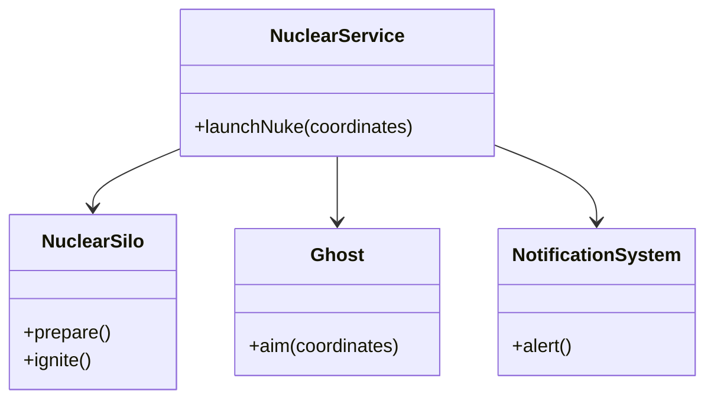

<script setup>
const exerciseFiles = [
  {
    filename: 'NuclearSilo.php',
    code: [
      '<?php',
      '',
      'class NuclearSilo',
      '{',
      '    public function prepare()',
      '    {',
      '        echo "[NuclearSilo] Checking inventory... Ready.\\n";',
      '        echo "[NuclearSilo] Opening silo doors...\\n";',
      '    }',
      '',
      '    public function ignite()',
      '    {',
      '        echo "[NuclearSilo] Ignition sequence start... 3... 2... 1...\\n";',
      '        echo "[NuclearSilo] BOOM! Missile launched!\\n";',
      '    }',
      '}',
    ].join('\n')
  },
  {
    filename: 'Ghost.php',
    code: [
      '<?php',
      '',
      'class Ghost',
      '{',
      '    public function aim($coordinates)',
      '    {',
      '        echo "[Ghost] Infiltrating area...\\n";',
      '        echo "[Ghost] Painting target at coordinates: $coordinates\\n";',
      '        echo "[Ghost] \'Never know what hit em.\'\\n";',
      '    }',
      '}',
    ].join('\n')
  },
  {
    filename: 'NotificationSystem.php',
    code: [
      '<?php',
      '',
      'class NotificationSystem',
      '{',
      '    public function alert()',
      '    {',
      '        echo "[Notification] ATTENTION: Nuclear Launch Detected.\\n";',
      '        echo "[Notification] Broadcasting to all channels.\\n";',
      '    }',
      '}',
    ].join('\n')
  },
  {
    filename: 'NuclearService.php',
    code: [
      '<?php',
      '',
      '/**',
      ' * TODO: 實作 NuclearService 外觀類別',
      ' * 1. 建構子接收三個子系統: NuclearSilo, Ghost, NotificationSystem',
      ' * 2. 實作 launchNuke($coordinates) 方法',
      ' *    依序執行:',
      ' *    a. echo "=== Commander initiated nuclear launch sequence ===\\n"',
      ' *    b. $this->silo->prepare()',
      ' *    c. $this->ghost->aim($coordinates)',
      ' *    d. $this->notification->alert()',
      ' *    e. $this->silo->ignite()',
      ' *    f. echo "=== Sequence completed ===\\n"',
      ' */',
    ].join('\n')
  },
  {
    filename: 'index.php',
    code: [
      '<?php',
      '',
      '// 建立子系統',
      '$silo = new NuclearSilo();',
      '$ghost = new Ghost();',
      '$notification = new NotificationSystem();',
      '',
      '// 建立外觀（Facade）',
      '$command = new NuclearService($silo, $ghost, $notification);',
      '',
      '// 指揮官只需要一行指令',
      'echo "Commander: I need a nuke at coordinates 100, 200.\\n";',
      'echo "System: Processing request via Facade...\\n\\n";',
      '',
      '$command->launchNuke("100, 200");',
      '',
      'echo "\\nSystem: Done.\\n";',
    ].join('\n')
  }
]

const answerFiles = [
  exerciseFiles[0],
  exerciseFiles[1],
  exerciseFiles[2],
  {
    filename: 'NuclearService.php',
    code: [
      '<?php',
      '',
      'class NuclearService',
      '{',
      '    protected $silo;',
      '    protected $ghost;',
      '    protected $notification;',
      '',
      '    public function __construct(NuclearSilo $silo, Ghost $ghost, NotificationSystem $notification)',
      '    {',
      '        $this->silo = $silo;',
      '        $this->ghost = $ghost;',
      '        $this->notification = $notification;',
      '    }',
      '',
      '    public function launchNuke($coordinates)',
      '    {',
      '        echo "=== Commander initiated nuclear launch sequence ===\\n";',
      '        $this->silo->prepare();',
      '        $this->ghost->aim($coordinates);',
      '        $this->notification->alert();',
      '        $this->silo->ignite();',
      '        echo "=== Sequence completed ===\\n";',
      '    }',
      '}',
    ].join('\n')
  },
  exerciseFiles[4]
]
</script>

# 外觀模式 (Facade Pattern)



## 何謂外觀模式

外觀模式為子系統中的一組介面提供了一個統一的高層介面，使得子系統更容易使用。簡單來說，就是封裝了複雜的子系統，對外只暴露簡單的交互介面，降低了客戶端與子系統之間的耦合度。

## 模式講解

這就像是餐廳的服務生（Facade），顧客（Client）只需要跟服務生點餐，而不需要親自去廚房找廚師、去吧台找調酒師、去櫃檯結帳。服務生會幫你協調這些後勤單位。

## 使用案例

以星海爭霸中的「核彈發射 sequence」為例：

1. 必須確認核彈發射井有核彈庫存且準備就緒
2. 必須指派幽靈特務進行戰術鎖定
3. 必須通過通訊系統發出警報
4. 執行點火發射

如果沒有外觀模式，指揮官必須手動操作每個步驟，這違反了**迪米特法則（最少知識原則）**。

## 互動練習

請完成 `NuclearService` 外觀類別，讓指揮官只需要一行指令就能發射核彈。

<ClientOnly>
  <PhpPlayground
    :files="exerciseFiles"
    :answer-files="answerFiles"
    entry-file="index.php"
    :readonly-files="['NuclearSilo.php', 'Ghost.php', 'NotificationSystem.php', 'index.php']"
  />
</ClientOnly>

::: tip 預期輸出
```
Commander: I need a nuke at coordinates 100, 200.
System: Processing request via Facade...

=== Commander initiated nuclear launch sequence ===
[NuclearSilo] Checking inventory... Ready.
[NuclearSilo] Opening silo doors...
[Ghost] Infiltrating area...
[Ghost] Painting target at coordinates: 100, 200
[Ghost] 'Never know what hit em.'
[Notification] ATTENTION: Nuclear Launch Detected.
[Notification] Broadcasting to all channels.
[NuclearSilo] Ignition sequence start... 3... 2... 1...
[NuclearSilo] BOOM! Missile launched!
=== Sequence completed ===

System: Done.
```
:::

## 缺點

1. **不符合開閉原則**：如果子系統的邏輯發生變化，可能需要修改外觀類別
2. **可能成為上帝物件**：如果承擔了過多責任，Facade 類別可能會變得臃腫
3. **功能受限**：Facade 通常只提供最常用的功能組合

## Laravel 中的 Facade

Laravel 的 Facade 提供了一個「靜態代理」的語法糖，例如 `Cache::put('key', 'value', 600)`，看起來是靜態方法，但實際上背後是 Service Container 中的實例物件，透過 `__callStatic()` 魔術方法動態解析。
