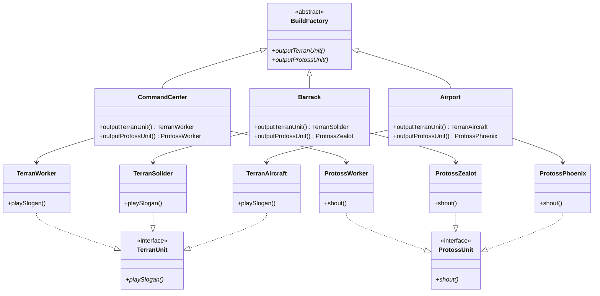

# 抽象工廠模式

## 何謂抽象工廠
與工廠方法相似，根據產品線去定義多個介面該產品的實際功能，再藉由生產者類別實作每個產品線中所對應的產品，最後再由抽象工廠去註冊這些產品的產出（可以隨時上架與下架該產品線）

## 模式講解
當已經定義好某些產品類別（product），你不會希望新增新的系列產品線（new product line）會造成你舊有的程式需要重新設計，最好的方式就是定義好工廠介面（即抽象工廠），並且定義好你的產品介面讓產品類別都需實作新的產品線

## 使用案例
我們繼續依照上次星海爭霸的案例繼續講解，一樣先了解此次需求：
1. 此次增加神族單位
2. 神族單位有聖堂武士、工兵以及鳳凰戰機
3. 須可以拓展到原先的建造指揮鏈上
4. 希望從某個建築產出時能同時建造兩個種族的單位

### 開始實作
預想的結果會是當指揮官輸入該建築代號時，會同時生產人族單位跟神族單位，並且出場時會發出他們的口號

1. 首先新增神族系列單位，他們出場時都會大喊，根據此特性定義單位介面 `ProtossUnit.php`
2. 開始實作每個神族單位 `ProtossPhoenix.php`、`ProtossWorker.php`、`ProtossZealot.php`
3. 在抽象工廠`BuildFactory.php`中註冊神族單位創造功能
4. 在各個生產者`Airport.php`、`Barrack.php`、`CommandCenter.php`實作創造單位的方法
5. 最後在`index.php`修改工廠的呼叫方法

## 缺點
1. 系統變得很複雜
2. 對於用戶端所有東西會變得很抽象(因為工廠數會非常多，每個工廠也會有不同產品實例)