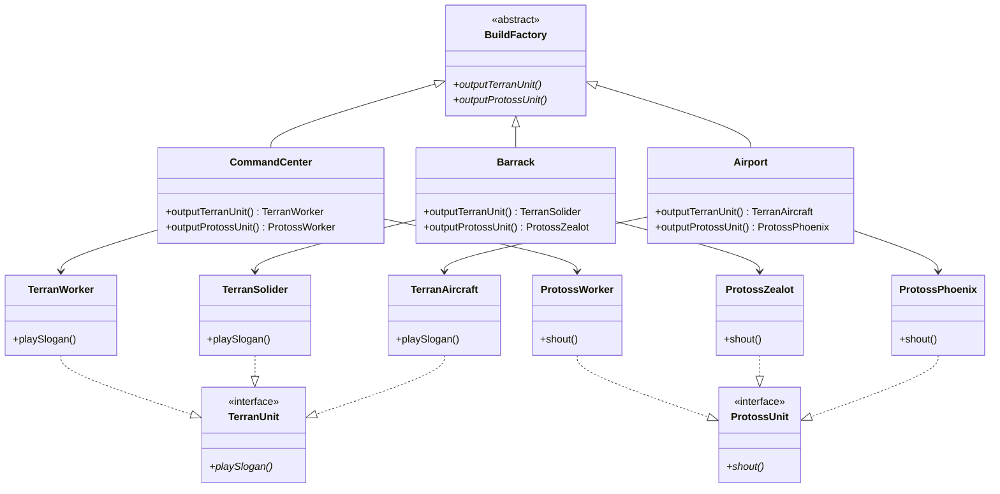

# 抽象工廠模式

## 說明
與工廠方法類似但工廠基類(這邊是BuildFactory)會包含多個產品線呼叫方法
用以水平增長不同Unit(產品)

---
比如，在工廠方法模式中`FactoryMethod.php`的方法是`outputUnit()`，因為當下需求是只生產人族單位。  
但現在還需新增神族單位這條產品線，所以`BuildFactory.php`裡的方法定義為`outputTerranUnit()`和`outputProtoss()`，以代表工廠對於兩種不同產品類別實現的接口方法。

## 缺點
1. 系統變得很複雜
2. 對於用戶端所有東西會變得很抽象(因為工廠數會非常多，每個工廠也會有不同產品實例)