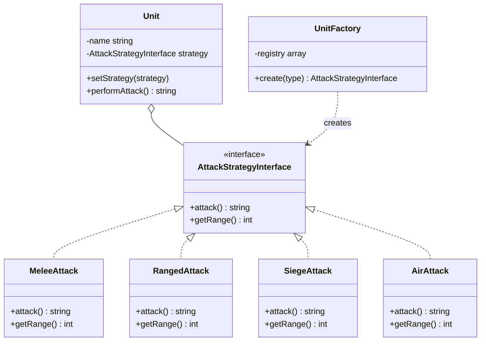

## 何謂策略模式
策略模式就像《星海爭霸》裡面的兵種設計:每個兵種都會「攻擊」,但攻擊的方式完全不同——狂戰士是近身肉搏、陸戰隊員是遠距離射擊、攻城坦克是超遠程砲擊、維京戰機則專打空中單位。

如果把所有攻擊邏輯塞在同一個 `Unit` 類別裡面,你會得到一團 `if ($type === 'zealot') ... else if ($type === 'marine') ...` 的災難。每次暴雪新增一個兵種,你就要回去改 `Unit` 類別,還要在每個用到兵種類型的地方都再改一次。

於是我們選擇策略模式來拯救你的部隊:
1. 定義一個「攻擊」的統一介面
2. 每種攻擊方式自己一個類別
3. `Unit` 只持有介面,不管是誰在打
4. 新增兵種 = 新增一個策略類,`Unit` 完全不用動

## 模式講解
1. 創建介面定義「一組可互換的演算法」共同的行為 (如:attack、getRange)
2. 每個具體演算法各自實作介面
3. 創建 Context (這裡是 Unit),透過組合持有策略介面
4. Context 只呼叫策略、不選擇策略——選擇由外部(玩家、工廠、設定檔)決定
5. 執行期可以動態 `setStrategy()` 替換演算法

## 使用時機
1. 一個行為有多種可互換的實作方式
2. 想避免一堆 if-else / switch-case 散落在核心邏輯裡
3. 想讓演算法可以在執行時動態切換
4. 遵守 SOLID 中的 OPEN/CLOSED 原則 (新增策略不用改 Context)
5. 遵守「組合優於繼承」原則

## 使用案例
你是《星海爭霸》的遊戲開發者,需要設計一套兵種攻擊系統:
1. 人族、神族、蟲族有各式各樣的兵種
2. 每個兵種的攻擊方式、傷害、射程都不同
3. 部分兵種還能「切換形態」(例如維京戰機可在戰機模式與機甲模式切換)
4. 未來 DLC 會新增兵種,但主程式不該因此每次都大改

## 關於「if-else 只是搬到 Client 端」的疑問
這是學策略模式時最常見的質疑。答案是:**if-else 沒有消失,而是被「集中」與「隔離」了。**

- ❌ 沒用策略模式:每個方法 (攻擊、計算射程、判斷傷害類型...) 都要重複寫一遍 if-else
- ✅ 用策略模式 + 工廠:if-else 只存在工廠**一個地方**,核心業務邏輯 (Unit) 完全乾淨
- 🚀 更進一步:工廠用 Map/Registry 註冊,連 if-else 都消失,新增兵種只要在 registry 加一行

**設計模式的精神不是消滅複雜度,而是把複雜度放到「對的地方」。**

## 開始實作解析
1. 定義統一介面 `AttackStrategyInterface`,規範所有攻擊策略都要有 `attack()` 和 `getRange()`
2. 建立具體策略類(每個兵種的攻擊方式各自一個類別):
   - `MeleeAttack` — 狂戰士 (Zealot) 近戰
   - `RangedAttack` — 陸戰隊員 (Marine) 遠程射擊
   - `SiegeAttack` — 攻城坦克 (Siege Tank) 砲擊
   - `AirAttack` — 維京戰機 (Viking) 對空
3. 建立 Context 類 `Unit`,透過建構子注入策略,並提供 `setStrategy()` 讓執行期能動態切換
4. 建立 `UnitFactory` 用 Map 註冊所有兵種 → 策略的對應,負責「選擇」哪個策略
5. 使用時:
   - `$zealot = new Unit('狂戰士', UnitFactory::create('zealot'));`
   - `$zealot->performAttack();`
6. 動態切換策略(例如維京切換形態、陸戰隊員升級):
   - `$marine->setStrategy(new SiegeAttack());`
7. 新增兵種完全不用改 `Unit`:只要新增一個策略類,在 `UnitFactory::$registry` 加一行即可——符合開放封閉原則 (OCP)
