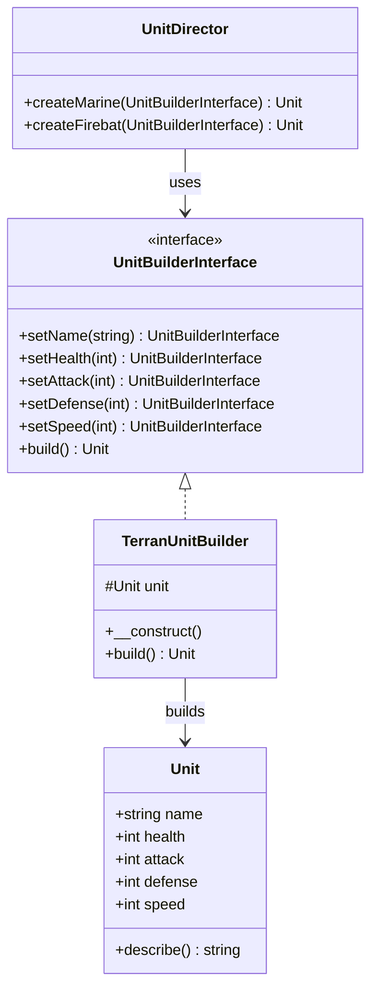

# 建造者模式

## 何謂建造者模式
> 將一個複雜物件的建構與其表示分離，使得同樣的建構過程可以創建不同的表示。

建造者模式就像現實世界的建築師一樣，建築師可以設計不同的房子，雖然每個房子長得不一樣，但建房子的步驟都一樣

## 模式講解
將某個重複性的物件分離其建構的邏輯（如武器、護甲、鞋子等），確保此物件保持組裝彈性

## 使用時機
1. 需要抽換不同組件
2. 建構過程過於複雜，需拆分多個步驟
3. 有相同建構流程但想產出不同物件
4. 減少建構子過於肥大

## 使用案例
星海爭霸中的各個單位都會有相同的建造模式，比如會穿鞋子、會有武器、會有護甲等，但每個單位的屬性都不一樣，所以可以使用建造者模式來進行建構

## 開始實作解析
1. 先定義unitBuilderInterface
2. 實作一個MarineBuilder類別，並實作unitBuilderInterface
3. 利用Decorator模式來區別不同單位的builder模型（可選) 