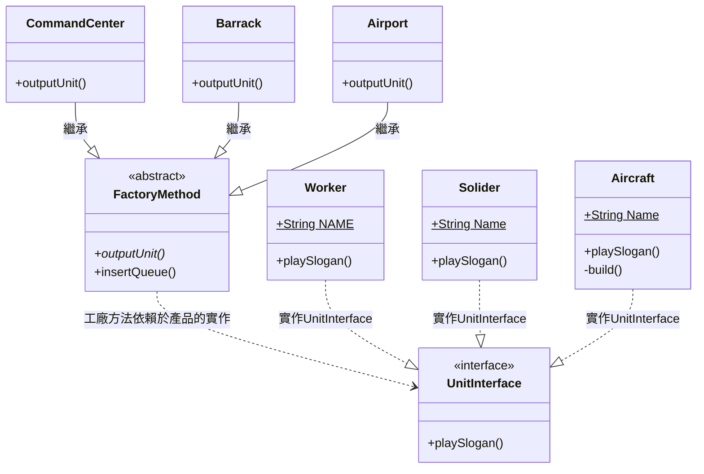

## 何謂工廠模式

>"Define an interface for creating an object, but let subclasses decide which class to instantiate. The Factory method lets a class defer instantiation it uses to subclasses." (Gang Of Four)

使用介面去定義每個產品應該做什麼，並且使用生產者類別去決定哪些產品類別該去實踐，而工廠方法則是將此概念實現的一種做法

## 模式講解
1. 將產品的行為定義一套標準並用介面去規範，逼迫接下來每個產品都至少要包含定義的行為(defined interface)
2. 將產品類別的實作放置於對應的生產者類別裡(class to subclass)
3. 使用工廠方法去定義每個生產者類別實作產品類別接口(declare class interface in factory method and extends it)
4. 使用者呼叫對應的生產者類別並使用工廠方法做到延遲以決定生產對應產品(Client defer instantiate and decide product class by creator class with factory method)

## 使用時機
1. 無法預先知道會使用哪種類別時？ 
    Ans: 工廠方法能將產品程式碼本身與使用它的程式碼進行分離
2. 擴展軟件或框架內的組件時？ 
    Ans: 一般來說我們會使用繼承來擴展程式碼，但這會造成耦合問題，所以使用子類來替代．此時工廠方法則可以幫助框架（或客端）集中建構程式碼並在該物件的時候重寫此方法
3. 重復使用？ 
    Ans: 重復使用被創建的物件這過程會是冗長的步驟，如果有使用工廠方法及可以在建立子類的當下檢查是否有重復使用過。

## 使用案例
我們依舊使用星海爭霸來進行案例操作，首先了解需求：
1. 建築物除了指揮中心，我們還多了兵營、星際港
2. 開發新兵種『幽靈戰機』
3. 我可以將任意單位建造依照需求加入佇列中

### 開始實作解析
預想中的藍圖會是當使用者按下Q、Ｗ、Ｅ來決定要從不同的建築生產該單位，那開始吧。
1. 首先完成產品(單位)吧，我們這次的單位有 **太空工程車**、**陸戰隊員**、**幽靈戰機**，但我們必須先定義單位本身該做什麼事，每當單位被產出時都會有自己的語音
2. 實作每個產品（單位）
3. 定義工廠方法，並且定義實作方法
4. 建立生產者(建築)來實例產品(單位)
5. 最後在統一呼叫生產者來進行產品的功能

-----------------------------------------------------------------

※   關於factory patterm的專案在寫法跟目錄架構上不是最完整並且是有明顯瑕疵，除了思考我想傳達的東西外，也可以試試如何讓這個項目變得更加完整

額外加場
[工廠模式在Laravel裡面是怎麼被使用](https://www.youtube.com/watch?v=cCRZGBQH9o4&t=378s)