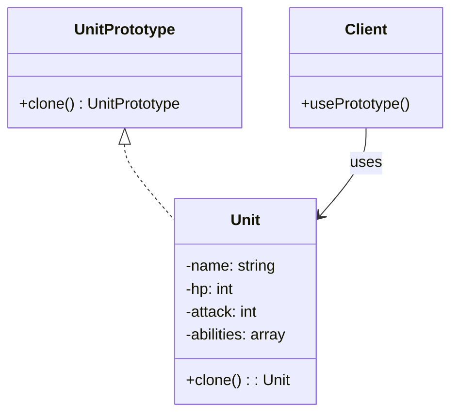

## 何謂原型模式
> Prototype 模式的核心概念是：建立新物件不是「建構」，而是「複製」一個已存在的樣板（prototype）。

## 模式講解
在PHP中，原型模式通常是透過`__clone()`魔術方法來實現的。當你想要複製一個物件時，你可以調用這個方法，這樣就能得到一個新的物件實例，而不是重新建構一個新的物件。

## 使用時機
1. 建立物件成本高（初始化很貴),比如物件內部有大量資料或複雜初始化流程。 
2. 想快速建立類似的物件, 建立一個「基本樣板」後，根據它改出變形版。 
3. 系統中物件種類繁多，但彼此結構接近, 用 prototype 可避免大量 new 物件 + 重複設值。 
4. 想動態決定要複製哪種實體類別, Prototype 模式不依賴類別名稱，而是 clone 實例。

## 使用案例
還記得蟲族的幼蟲嗎，不必重新建造一個新的幼蟲（因為玩家也不能直接操作他們)，直接複製一個就可以了

## 開始實作解析
1. 先實作一個UnitPrototype類別
2. 創建一個Unit類別並繼承UnitPrototype
3. 使用`__clone()`方法來實現物件複製時所需的動作
4. 在client中使用`clone`方法來複製物件