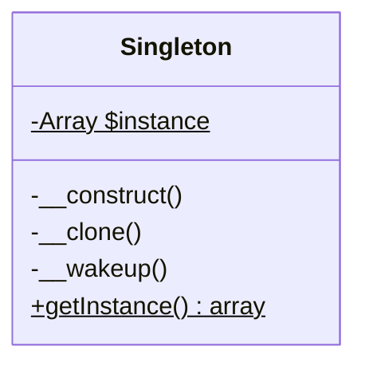

## 何謂單例模式
1. 保證一個類別只有一個實體。
2. 為實體提供一個統一的訪問位置。

單例模式就像現實世界的政府一樣，不管政府是由誰掌控，或者哪個黨上台，當你需要公權力介入時，“政府”就會進行回應

## 模式講解
1. 將建構子設為私有，防止被`new`運算符使用
2. 使用一個公開的建構函數（如getInstance()函式），這個函式會私下使用建構子並把它保存在靜態變數中(static parameter)，確保後續都返回同一個物件

## 使用時機
1. 確保使用的實例都是同一個
2. 保護此實體的全局變數不被進行修改
3. 程式發生問體只需修改一個地方

## 使用案例
在星海爭霸中，英雄單位都是獨一無二的，不像陸戰隊員可以同時出現在不同地方，所以英雄單位很適合使用單例模式

### 開始實作解析
1. 先實作一個Singleton類別
2. 創建一個英雄類別並繼承Singleton
3. 在英雄類別加入可以被使用的方法
4. 在使用的程式中取得英雄單位的實體

---

單例模式因其便利性確實還有許多框架使用，但其實此模式違反了設計模式中的單一職責原則（此模式可以大範圍被函式使用），大量使用此模式可能造成測試上的困難，目前php開源社群正逐漸淘汰此設計模式
