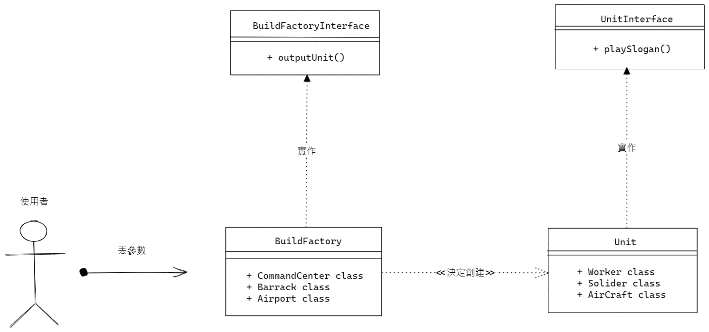

## 何謂工廠模式

>"Define an interface for creating an object, but let subclasses decide which class to instantiate. The Factory method lets a class defer instantiation it uses to subclasses." (Gang Of Four)

依照預先定義的interface去創建一系列物件，但是讓其中的**某個物件**去決定其餘物件**何時被實例化**，而這推遲的效果幫助使用者更好的操作裡面的物件

------------------------------------------------------------------

## 使用時機
今天你的某個方法在其他的class裡都會出現，但其方法在各個class都有些微不同 

    星海裡每個單位從建築物產出時都會喊一個口號

可是每個口號都不一樣，那我們可以定義一個喊口號的interface

除此之外我們還要有個不同的建築物(Factory)去生產這些單位

    同樣每個建築物都要產單位

所以我們也能定義一個**生產單位**的interface

最後玩家(使用者)只要點選建築物並按下產單位就會產出帶有各自口號的單位囉

> 某個陸戰隊員：你有發現每個從兵營出來的陸戰隊都沒有再回來過了嗎

---------------------------------------------------------------

※   關於factory patterm的專案在寫法跟目錄架構上不是最完整並且是有明顯瑕疵，除了思考我想傳達的東西外，也可以試試如何讓這個項目變得更加完整

額外加場
[工廠模式在Laravel裡面是怎麼被使用](https://www.youtube.com/watch?v=cCRZGBQH9o4&t=378s)