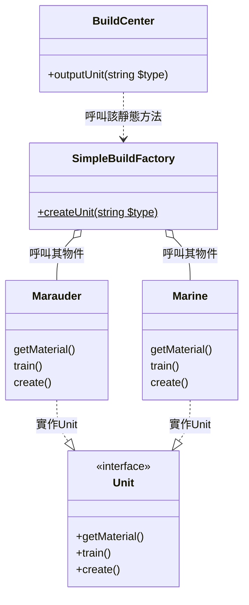

# 簡單工廠(工廠)模式
當服務(產品)的種類比較單一，且不容易會有擴展或更改其當初設計時，就很適合使用簡單工廠模式。

使用者`BuildCenter.php`他可以不需要知道**陸戰隊**`Marine`和**掠奪者**`Marauder`要怎麼建造，他只要告訴`SimpleBuildFactory.php`
我需要陸戰隊還是掠奪者就好，剩下就是等單位生產出來。

## 缺點
可以看到`SimpleBuildFactory.php`部分，當你的產品線越來越複雜時，你的switch(或if)將會長得非常恐怖