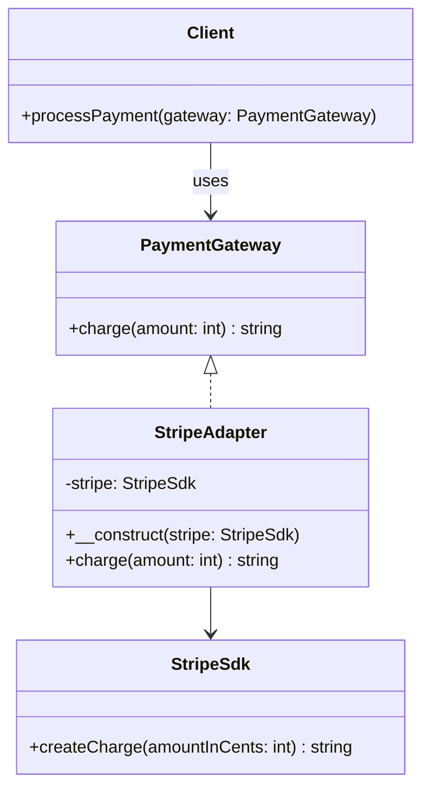

## 何謂調配器模式
用最日常的例子來說就是手機充電線通常是USB的頭，但牆壁的頭是兩孔甚至是三孔..... 
如果要讓手機充電，就需要一個轉接頭（你可能從一些老師傅的口中聽過阿搭舖特)，這就是調配器模式的概念，讓你既不用改USB的頭也不用改牆壁的插孔

但要實作調配器前有兩個前提：
1. 你必須確保USB頭永遠不變（外接的程序介面不變)
2. 你必須確保牆壁的插孔永遠不變（核心處理程序的介面不變)

## 模式講解
1. 你有一個核心處理程序的介面（這裡是PaymentGateway），這裡將統一處理方法
2. 撰寫Adapter類別，這個類別會實作核心處理程序的介面（這裡是StripeAdapter），並且在這個類別中使用你要調配的類別（這裡是StripeSdk）
3. 在Adapter類別中實作核心處理程序的介面（即PaymentGateway的charge方法），並在這個方法中調用你要調配的類別的方法（在charge方法中使用StripeSdk的createCharge完成金額轉換的部分）

## 使用時機
1. **導入第三方 SDK，但介面不同**，如 Stripe、GCP、AWS SDK、老舊 ERP 
2. **想讓舊程式碼能配合新架構**，可用 Adapter 包住老的類別接口
3. **想讓相同接口支援多種實作** e.g. Laravel Cache 支援多驅動就是典型

## 使用案例
以製作小型的付款模組為例，目前我方獲得了兩個第三方金流SDK，目前已知的功能有充值跟退款
### 開始實作解析
1. 定義付款模組本身需要哪些動作(如充錢，退款等)
2. 建立第三方SDK的調配器
3. 調用調配器已進行付款

---
調配器模式在Laravel 中有很多應用，像是Laravel的Cache、Queue、Log等模組都是使用調配器模式來實作的。這些模組都會定義一個統一的介面，然後根據不同的驅動程式來實作這個介面，讓使用者可以方便地切換不同的驅動程式，而不需要改變原本的程式碼。

