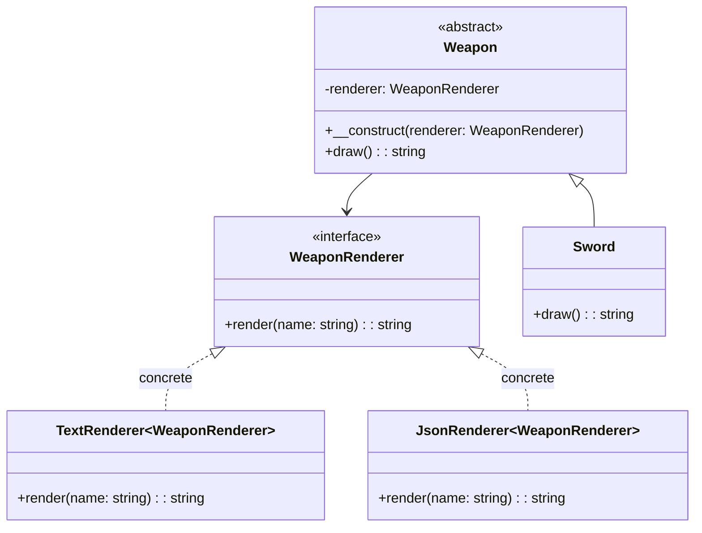

## 何謂橋接模式
橋接模式的概念是將抽象部分與實現部分分離，這句話聽起來很不靠譜也難理解，那舉個簡單的例子 
知道博德之門吧？「對話」這個要素在這款遊戲佔了很大比重，且玩家讓不同角色跟NPC對話都會觸發不同文本 
而在對話的呈現上又可以分『文字』、『語音』、『動畫』等多種方式 
那這個對話模組就很有使用橋接模式的必要了

## 模式講解
1. 定義你的抽象類別
2. 開始拆分抽象類別中會實作的類別
3. 將抽象與實作類別進行對接並呈現效果

## 使用時機
1. 各對話模式模式對應多角色自由組合？ 各自獨立擴展、互不影響
2. 避免 class 爆炸？ 如果有很多角色、很多對話模式，會導致 class 爆炸
3. 可測性？ 拆開來檢測角色的對話文本，拆開文本的顯示方式檢測都會變得相對簡單

## 使用案例
就依照博德之門當作例子，做出 Lae’zel、Shadowheart的對話模組
### 開始實作解析
1. 抽象層：角色對話
2. 實作層：對話呈現方式
3. 抽象層與實作層進行對接：具體角色對話功能
4. 實作對話功能

--- 
## Laravel 怎麼做
Laravel 的 Mailer 功能就是一道經典案例，他把`寫信`跟`送信`這兩件事情拆開 
**寫信** 的功能屬於抽象層，這邊指關注怎麼寫信（不管是用 HTML、Markdown、Blade 等等） 
**送信** 的功能屬於實作層，這邊指關注怎麼送信（不管是用 SMTP、SendGrid、Mailgun 等等） 