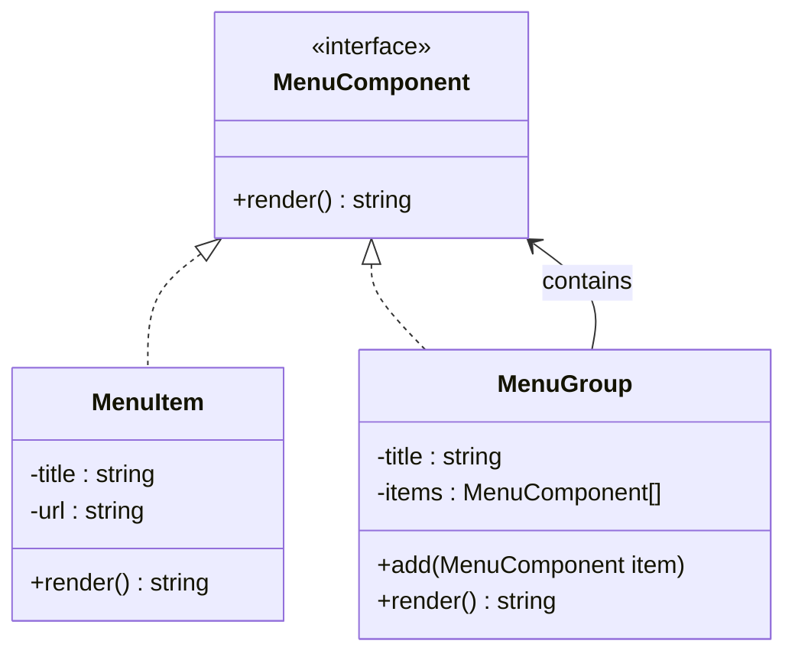

## 何謂組合模式
此模式偏向是一種設計概念，凡設計結構偏向樹狀結構，都可以使用此模式

## 模式講解
假設我們用一棵樹的方式來描述，它通常會包含三個角色：
1.	**Component（元件介面)**：定義所有具體元件和容器的共同行為。
2.	**Leaf（葉節點）**：樹的最底層，不包含子元素。例如：檔案、員工。
3.	**Composite（容器）**：可以包含其他 Leaf 或 Composite，本身也是一個 Component。 例如：資料夾、部門。

## 使用案例
每個網站都有一個導航列，這個導航列通常會包含多個選單項目，非常適合用來表示此模式的設計核心

### 開始實作解析
1. 創建介面與元件
2. 單一節點
3. 組合節點
4. 組合節點與單一節點進行對接