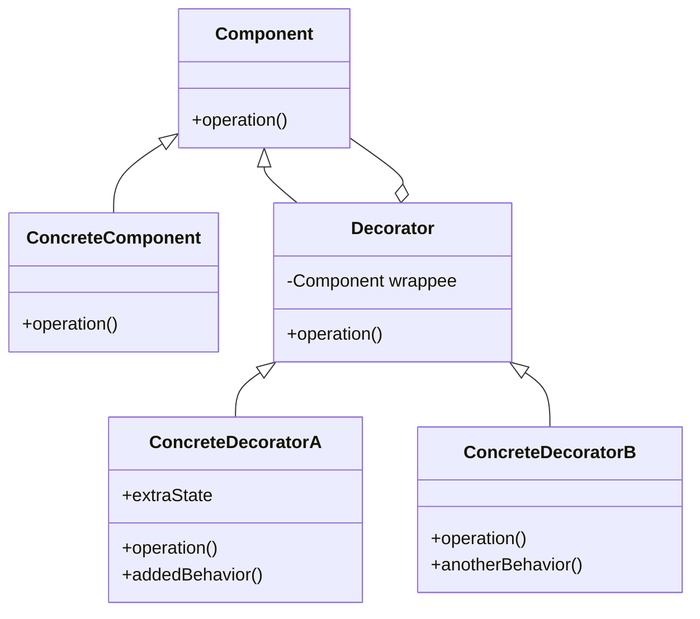

## 何謂裝飾模式
這個設計概念滿像俄羅斯娃娃，規範目標對象以及裝飾器都使用統一接口後，就可以無限層的對程式碼進行「加料」，所以我們以漢堡舉例（又有誰不喜歡漢堡呢），來看一下會發生什麼事：
1. 首先我們先創建一個基本漢堡
2. 新需求需要加上起司、蛋、培根
3. 開始創建類別BuggerWithEggs、BuggerWithChessEggs、BuggerWithChess....

於是乎你開始懷疑為什麼走上程式設計這條路...

為了你的身心健康，選擇了裝飾器設計模式來解決你的漢堡問題，如下：
1. 首先創建一個基本漢堡
2. 新需求需要加上起司、蛋、培根
3. 創建一個加料裝飾器
4. 創建你的加料類
5. 無限制加料 -> 奇蹟漢堡的誕生

## 模式講解
1. 創建接口讓所有類別統一實作定義的行為
2. 創建一個基本類別，此類別會是原先依照初始需求所設計
3. 創建抽象的Decorator，然後這個Decorator會包裝每次創建的具體Decorator
4. 實作各項實體Decorator
5. 使用時即可層層套入被創建的各個實體

## 使用時機
1. 避免繼承爆炸
2. 動態擴充功能，不需要改原本的class
3. 遵守SOLID中，OPEN/CLOSED原則

## 使用案例
你是個有創意的人，雖然現在只有簡單的手拍牛漢堡，但其他口味的漢堡將在未來退出
1. 你的主要商品是牛肉堡
2. 你未來的產品將是已不同形式的配料搭配牛肉堡本身推出
3. 未來出的配料以及配餐是無法預測，但他們都會有**價格**標示

## 開始實作解析
1. 定義統一接口 Food 來保證製作漢堡的過程中都會實作到這個方法
2. 創建基本類（如同：Burger）
3. 建立一個抽象裝飾器（Decorator），並實作相同的接口，內部持有一個 Food 實例  
4. 建立各種具體裝飾器（例如：CheeseDecorator、EggDecorator、BaconDecorator），在 operation() 中先做自己的事，再呼叫被包裝的 Food->operation()  
5. 使用時只需要動態包裝：  
   - $food = new CheeseDecorator(new Burger());  
   - $food = new EggDecorator($food);  
   - $food = new BaconDecorator($food);  
6. 你可以無限疊加裝飾器，而不需要每次都創一個 BuggerWithXXX 的新 class  
7. 原本的基本類完全不需要修改，符合開放封閉原則（OCP）