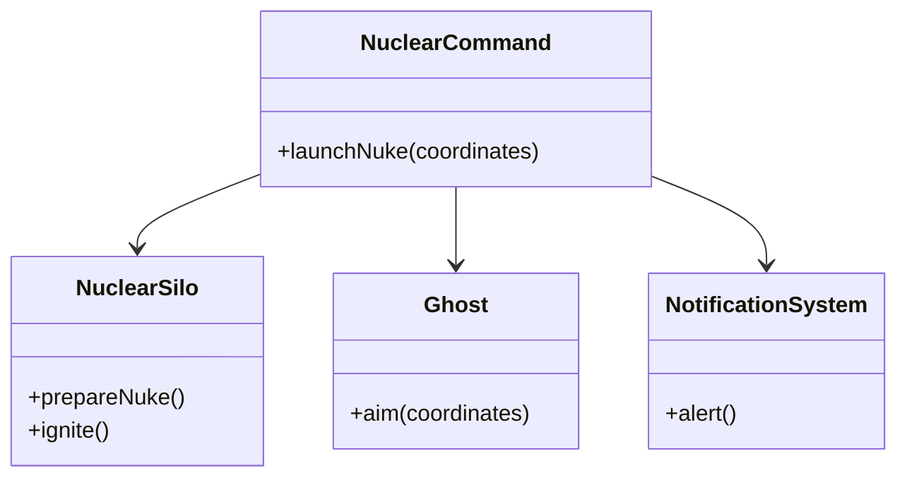

# 外觀模式 (Facade Pattern)



## 何謂外觀模式
外觀模式（Facade Pattern）是一種結構型設計模式，它為子系統中的一組介面提供了一個統一的高層介面，使得子系統更容易使用。簡單來說，就是封裝了複雜的子系統，對外只暴露簡單的交互介面，降低了客戶端與子系統之間的耦合度。

## 模式講解
當一個系統功能越來越強大，子系統的元件會越來越多且複雜。為了避免客戶端（Client）直接與眾多子系統內的各個類別產生緊密耦合（Coupling），以及避免客戶端必須了解錯綜複雜的內部邏輯，我們可以使用外觀模式來提供一個簡單的入口（Interface）。客戶端只需要跟這個「外觀」（Facade）互動，而不需要知道背後複雜的運作流程。

這就像是餐廳的服務生（Facade），顧客（Client）只需要跟服務生點餐，而不需要親自去廚房找廚師、去吧台找調酒師、去櫃檯結帳。服務生會幫你協調這些後勤單位。

## 使用案例
我們以星海爭霸（StarCraft）中的「核彈發射 sequence」為例：

1. **情境**：發射一枚核彈，並非單純的「按下按鈕」這麼簡單，它涉及多個單位的協同運作。
2. **需求**：
   - 必須確認核彈發射井（Nuclear Silo）有核彈庫存且準備就緒。
   - 必須指派幽靈特務（Ghost）進行戰術鎖定（Laser Designate）。
   - 必須通過通訊系統（Notification System）發出 "Nuclear Launch Detected" 警報。
   - 執行點火發射。

3. **問題**：如果沒有外觀模式，指揮官（Client）必須手動操作：
   ```php
   $silo->checkInventory();
   $ghost->assignTarget($coord);
   $notification->broadcast("Nuclear Launch Detected");
   $silo->launch();
   ```
   這違反了迪米特法則（最少知識原則），指揮官知道太多細節了。

### 開始實作
預想結果：指揮官只需要接觸「核彈發射控制台」（NuclearCommand），輸入一個座標，系統自動完成後續作業。

1. **定義子系統介面與實作**：
   - `NuclearSilo.php`：負責管理核彈庫存、填裝與點火。
   - `Ghost.php`：負責接收座標指令，前往該處進行引導。
   - `NotificationSystem.php`：負責全頻廣播核彈偵測警報。

2. **建立外觀類別（Facade）**：
   - 建立 `NuclearCommand.php`。
   - 建構子中實例化（或注入）上述三個子系統物件。
   - 提供一個簡單的方法 `launchNuke($coordinates)`。
   - 在 `launchNuke` 內部依序呼叫子系統的邏輯：
     1. `this->silo->prepare()`
     2. `this->ghost->aim($coordinates)`
     3. `this->notification->alert()`
     4. `this->silo->ignite()`

3. **客戶端呼叫（Client）**：
   - 在 `index.php` 中，指揮官只需：
     ```php
     $command = new NuclearCommand();
     $command->launchNuke("200, 300");
     ```

## 缺點
1. **不符合開閉原則（Open-Closed Principle）**：如果子系統的邏輯發生變化（例如發射流程改變），可能需要修改外觀類別的程式碼。
2. **可能成為上帝物件（God Object）**：如果外觀類別承擔了過多責任，或者子系統過於龐大，Facade 類別可能會變得非常臃腫且難以維護。
3. **功能受限**：為了簡化介面，Facade 通常只提供最常用的功能組合。對於需要深度客製化或存取底層細節的進階使用者來說，Facade 提供的介面可能不夠用（不過外觀模式通常不禁止繞過 Facade 直接存取子系統）。

## Laravel 之中的 Facade

在 Laravel 框架中，Facade 是一種非常有特色的設計模式應用，但它與傳統的 GoF Facade 模式略有不同。

### 使用方式
你可能經常寫這樣的程式碼：
```php
use Illuminate\Support\Facades\Cache;

Cache::put('key', 'value', 600);
$value = Cache::get('key');
```
看起來我們是在呼叫一個靜態方法（Static Method），但實際上 `Cache` 背後對應的是 Service Container 中的一個實例物件。

### 原理講解 (Magic Methods)
Laravel 的 Facade 依賴 PHP 的魔術方法 `__callStatic()`。

1. **Facade 基底類別**：
   所有的 Laravel Facade 都繼承自 `Illuminate\Support\Facades\Facade` 抽象類別。
   這個基類實作了 `__callStatic()`。

2. **getFacadeAccessor()**：
   每個具體的 Facade（例如 `Cache`）只需要實作一個方法 `getFacadeAccessor()`，回傳一個字串（Service Container 的綁定名稱）。
   ```php
   protected static function getFacadeAccessor() {
       return 'cache'; // 對應到容器中的 cache 服務
   }
   ```

3. **動態解析**：
   當你呼叫 `Cache::get()` 時：
   1. 因為 `get` 不是靜態方法，觸發 `__callStatic('get', ...)`。
   2. `__callStatic` 內部會呼叫 `getFacadeRoot()`。
   3. `getFacadeRoot()` 會根據 `getFacadeAccessor()` 回傳的名稱（'cache'），從 Service Container 解析出真正的物件實例。
   4. 最後在這個實例上呼叫 `get()` 方法。

### 總結
Laravel 的 Facade 提供了一個「靜態代理（Static Proxy）」的語法糖，讓開發者可以用簡潔的靜態語法來使用底層複雜的動態物件，這完美體現了外觀模式「簡化介面」的精神，同時利用 Service Container 保持了可測試性與彈性，等等我們將會使用上述例子，來示範假如以Laravel架構實現核彈打擊會是什麼樣子。
